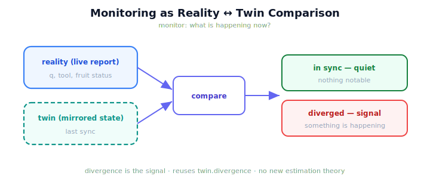

!!! abstract "You are here"
    **Module 10 — Digital Twin Capstone**  ·  **Unit 5 — Monitoring with the Twin**  ·  **Lesson 5.1 — Monitoring as Reality ↔ Twin Comparison**

# Lesson 5.1 — Monitoring as Reality ↔ Twin Comparison

> The back half of the module puts the twin to work, and the first job is the most immediate one: *monitoring*. A monitor asks "what is happening now?" — and the twin answers it not with a new sensor, but by holding up a mirror and noting where reality fails to match it.

---

## 1. Why This Matters
You cannot manage what you cannot see. A deployed harvester needs someone watching whether it is behaving as expected — and the twin, already a faithful mirror of the system's reported state, is perfectly placed to be that watcher. Monitoring with a twin means continuously comparing reality's live report against the twin's mirrored state: agreement means "as expected," divergence means "something is happening here." This reframes monitoring from "build a special anomaly detector" into "compare against the twin you already have." It is the first and most direct payoff of having built the twin.

## 2. Physical Intuition
A conductor following the score while the orchestra plays. The score (the twin) says what *should* be happening at each moment; the conductor listens to the orchestra (reality) and instantly notices where the two part company — a missed entry, a wrong note. The conductor isn't measuring anything new; they're *comparing* the live performance to the reference they're holding. Monitoring the robot with a twin is exactly that comparison: the twin is the score, reality is the performance, and the monitor's attention is on the difference.

## 3. Mathematical Foundations
Monitoring is a **comparison**, not an estimator. The twin holds a mirrored state $s_{\text{twin}}$ (from the last sync); reality emits a live report $s_{\text{real}}$. The monitor reads the **divergence** between them — the same Reality ↔ Twin gap introduced as sync error (2.3):

$$\text{monitor}(s_{\text{real}}) = \big(\,\Delta q,\ \Delta \text{tool},\ \text{fruit mismatch}\,\big),\qquad \text{alert} = \big[\text{divergence} > \text{tolerance}\big].$$

When the divergence is within tolerance, the twin and reality agree — the system is behaving as the twin expects, and the monitor is quiet. When the divergence exceeds tolerance, **something is happening that the twin did not account for**, and the monitor raises a signal. Three things make this honest and lightweight. (1) It **reuses existing state** — `twin.divergence` from Installment A — with **no new estimation theory**. (2) The **question it answers is "what is happening now?"** — a present-tense comparison, not a forecast. (3) The **divergence *is* the signal**: monitoring doesn't decide what to do, it surfaces *where reality and the twin disagree* so a human or a later stage can act. The twin is useful here precisely because it can disagree with reality.

## 4. Visual Explanation

<figure markdown>
  { width="680" }
</figure>

## 5. Engineering Example
Watching a harvest in progress. Sync the twin to the robot's reported state, then monitor: as long as reality's reports keep matching the twin, the monitor stays quiet — the harvest is going as expected. Now suppose reality experiences something the twin didn't account for — the arm ends up in a configuration the twin's mirrored state doesn't match. The comparison immediately shows a nonzero joint and tool divergence, and the monitor raises a signal: *something is happening now*. You didn't add a sensor or train a detector; you compared reality to the twin you already had, and the disagreement told you to look.

## 6. Worked Example
Right after a sync, the monitor reports zero divergence and stays quiet. A moment later, without re-syncing, the monitor reports a nonzero joint gap. What happened, and what does the monitor's silence-then-signal tell you? Reasoning: immediately after a sync, the twin's state equals reality's report, so the divergence is zero and the monitor is quiet ("in sync"). The later nonzero gap means **reality moved on while the twin held its last snapshot** — reality and the twin now disagree, which is the monitoring signal that *something is happening*. The monitor is not telling you *what* (that's diagnosis, 5.3) or what *will* happen (that's prediction, Unit 6); it is telling you, in the present tense, that reality has departed from the twin's expectation. Re-syncing would zero the gap again — but you'd lose the signal, so a monitor reads the divergence *before* re-syncing.

## 7. Interactive Demonstration

<iframe src="../../demos/module10/lesson17_monitoring_comparison.html" title="Monitoring as Reality ↔ Twin Comparison interactive demo" style="width:100%;height:520px;border:1px solid #e2e8f0;border-radius:12px"></iframe>

[Open this demo in a new tab ↗](../demos/module10/lesson17_monitoring_comparison.html)

*(Conceptual — previews Unit 6's Lookahead & What-If flagship.)*
Sync the twin and watch the monitor stay quiet while reality matches it; then let reality move and watch the divergence rise and the monitor raise a signal; re-sync and watch it fall quiet again. The demonstration makes "monitoring = Reality ↔ Twin comparison, divergence = signal" concrete.

## 8. Coding Exercise

!!! tip "Run the hands-on notebook"
    `modules/module10/notebooks/lesson17_monitoring_comparison.ipynb` — open in JupyterLab and run **Kernel → Restart & Run All**.

*(The notebook monitors a Reality ↔ Twin comparison.)*
Sync a twin to reality and call `monitor`; assert no alert (in sync). Then move reality (without re-syncing) and assert the monitor now raises an alert with a nonzero divergence. Re-sync and assert the alert clears. This establishes monitoring as a comparison whose signal is divergence.

## 9. Knowledge Check

Formative — unlimited attempts, immediate feedback; does not affect your grade.

<iframe src="../../quizzes/module10/lesson17_quiz.html" title="Monitoring as Reality ↔ Twin Comparison knowledge check" style="width:100%;height:720px;border:1px solid #e2e8f0;border-radius:12px"></iframe>

[Open this quiz in a new tab ↗](../quizzes/module10/lesson17_quiz.html)

*(Formative — unlimited attempts, immediate feedback.)*
Confirm that monitoring is a Reality ↔ Twin comparison answering "what is happening now?", that divergence is the signal, that it reuses existing state (no new estimation theory), and what the monitor's silence vs signal means.

## 10. Challenge Problem
A monitor that re-syncs the twin on every report would always show zero divergence — and therefore never raise a signal. Explain why this defeats the purpose of monitoring, and propose how often (relative to reading the divergence) a twin *should* be re-synced so the monitor stays useful. Keep the reasoning about the comparison, not a new algorithm.

## 11. Common Mistakes
- **Thinking monitoring needs a new detector.** It is the Reality ↔ Twin comparison you can already make.
- **Re-syncing before reading the divergence.** That zeroes the gap and erases the signal.
- **Confusing "now" with "next."** Monitoring is present-tense; forecasting is Unit 6.
- **Treating divergence as failure.** Divergence is a *signal* — it says "look here," not "this is broken."

## 12. Key Takeaways
- **Monitoring** is a **Reality ↔ Twin comparison** that answers "**what is happening now?**"
- **Divergence is the signal**: agreement means "as expected," disagreement means "something is happening."
- It **reuses existing state** (`twin.divergence`) — **no new estimation theory**.
- A monitor must read the divergence **before re-syncing**, or the signal disappears.
- The twin is useful here **because it can disagree with reality** — informatively.

---

## AI Learning Companion
Copy any prompt into an AI assistant.

**Tutor prompt** — explain it another way
```
Re-explain Lesson 5.1 with a conductor following a score while the orchestra plays — comparing the live performance to the reference and noticing where they diverge.
```
**Practice prompt** — generate more exercises
```
Give me 4 scenarios where I decide whether a monitor (Reality ↔ Twin comparison) stays quiet or raises a signal. With answers.
```
**Explore prompt** — connect it to the real world
```
Show me how real digital twins are used to monitor live assets by comparing telemetry against the twin's expected state.
```

## Global Learning Support
Need this lesson in another language? Copy a prompt below into an AI assistant. English is the authoritative source.

**Supported languages (initial):** English · Español · 中文 (Simplified Chinese) · Türkçe

```
I just completed Lesson 5.1 — Monitoring as Reality ↔ Twin Comparison.
Explain this lesson in Español. Keep robotics/math terminology in English where appropriate.
Then provide: a summary, three practice questions, and one challenge problem.
```
```
I just completed Lesson 5.1 — Monitoring as Reality ↔ Twin Comparison.
Explain this lesson in 中文 (Simplified Chinese). Keep robotics/math terminology in English where appropriate.
Then provide: a summary, three practice questions, and one challenge problem.
```
```
I just completed Lesson 5.1 — Monitoring as Reality ↔ Twin Comparison.
Explain this lesson in Türkçe. Keep robotics/math terminology in English where appropriate.
Then provide: a summary, three practice questions, and one challenge problem.
```

---

*Next lesson: 5.2 — Divergence as a Signal.*
