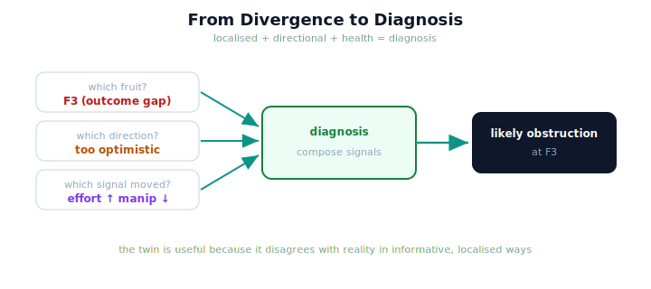

!!! abstract "You are here"
    **Module 10 — Digital Twin Capstone**  ·  **Unit 5 — Monitoring with the Twin**  ·  **Lesson 5.3 — From Divergence to Diagnosis**

# Lesson 5.3 — From Divergence to Diagnosis

> Detecting that reality and the twin disagree is the first step; the payoff is saying *how*. Because the twin's divergence names which fruit, which direction, and which signal moved, a monitor can go beyond "something happened" to "*this* happened, *here*." That is diagnosis.

---

## 1. Why This Matters
An alarm that only says "problem" sends you hunting; an alarm that says "F3 predicted harvested, actually skipped, and effort spiked on that pick" sends you straight to the cause. The twin's divergence is inherently *localised* (it names the fruit, the joint, the signal) and *directional* (optimistic vs pessimistic), so it supports real diagnosis, not just detection. And the twin already carries Module 9's health signals in its snapshot — peak error, manipulability, effort — which, read alongside the divergence, characterise *what kind* of departure occurred. Diagnosis is where monitoring earns its keep: it converts a signal into an actionable account of reality.

## 2. Physical Intuition
A doctor reading a specific symptom, not just "you're unwell." "You're sick" prompts a search; "you have a fever of 39°C and a sore throat on the right side" points at a diagnosis. The localised, characterised signal is what makes the difference. The twin's divergence is the specific symptom: not "the harvest went wrong" but "F3 was skipped though predicted harvested, and the effort signal on that pick was high." That specificity is what lets you name the cause.

## 3. Mathematical Foundations
Diagnosis composes the monitor's **localised** signals into an account. The outcome gap already names *what* diverged and *which direction*: a fruit in `harvested_only_in_sim` (twin too optimistic — reality skipped what the twin expected to pick) versus `harvested_only_in_real` (too pessimistic). The state divergence names *where* in configuration the twin and reality part. And the snapshot carries Module 9's **health signals** — peak tracking error, RMS, minimum manipulability/$\sigma_{\min}$, peak effort, saturation fraction — which characterise *how* a pick behaved. Reading these together:

$$\underbrace{\text{which fruit}}_{\text{outcome gap}} \;+\; \underbrace{\text{which direction}}_{\text{optimistic / pessimistic}} \;+\; \underbrace{\text{which signal moved}}_{\text{health signals}} \;\Rightarrow\; \text{a diagnosis.}$$

For example: F3 predicted-harvested but actually-skipped (optimistic outcome divergence) *together with* a high effort / low manipulability reading on the approach to F3 suggests reality met an obstruction or a hard configuration there — an unmodeled effect localised to F3. Crucially, **no new estimation theory** is added: diagnosis is *interpretation* of existing localised signals, not a new inference engine. This is the strongest statement of the twin's monitoring value — it disagrees with reality in **informative**, *localised* ways, so its disagreements double as diagnoses.

## 4. Visual Explanation

<figure markdown>
  { width="680" }
</figure>

## 5. Engineering Example
Diagnosing a skipped fruit. The monitor fires an outcome divergence: F3 predicted harvested, actually skipped — an optimistic surprise localised to F3. You pull the health signals for that pick from the snapshot: effort peaked and manipulability dipped on the approach to F3, while the other picks read normal. The composed diagnosis: reality met something on the F3 approach that the twin doesn't model — most likely an obstruction or a near-singular configuration there. That is a specific, actionable account, assembled entirely from signals the twin already exposes. And it tells calibration (4.3) exactly what to model next.

## 6. Worked Example
Two harvests both show an outcome divergence on a fruit, but: case A's health signals on that pick read normal, while case B's show a large effort spike and low manipulability. How do the diagnoses differ? Reasoning: in both, the twin was wrong about that fruit — but the *character* differs. Case A (normal health, yet the fruit diverged) suggests the surprise was not in the *execution* effort — perhaps a perception or layout difference (the fruit wasn't where/what the twin thought). Case B (effort spike, low manipulability) points at an *execution-side* obstruction or a hard configuration on the approach. Same headline ("fruit diverged"), different diagnoses — because the health signals characterise *how* it diverged. This is why diagnosis combines the outcome gap with the health signals rather than reading either alone.

## 7. Interactive Demonstration
*(Conceptual — previews Unit 6's Lookahead & What-If flagship.)*
A diagnosis panel: trigger an outcome divergence and watch the monitor assemble which-fruit, which-direction, and which-health-signal into a plain-language cause; change the underlying effect and watch the diagnosis change with it. The demonstration shows divergence becoming diagnosis.

## 8. Coding Exercise

!!! tip "Run the hands-on notebook"
    `modules/module10/notebooks/lesson19_divergence_diagnosis.ipynb` — open in JupyterLab and run **Kernel → Restart & Run All**.

*(The notebook turns divergence into a diagnosis.)*
With an unmodeled effect on one fruit, compute the outcome gap (which fruit, which direction) and read the health signals from the pipeline; assert the diagnosis localises to that fruit and that the direction is "optimistic" (predicted harvested, actually skipped). This verifies divergence-to-diagnosis from existing signals.

## 9. Knowledge Check

Formative — unlimited attempts, immediate feedback; does not affect your grade.

<iframe src="../../quizzes/module10/lesson19_quiz.html" title="From Divergence to Diagnosis knowledge check" style="width:100%;height:720px;border:1px solid #e2e8f0;border-radius:12px"></iframe>

[Open this quiz in a new tab ↗](../quizzes/module10/lesson19_quiz.html)

*(Formative — unlimited attempts, immediate feedback.)*
Confirm that diagnosis combines which-fruit (outcome gap), direction, and which-health-signal, that it reuses existing signals (no new estimation theory), and that informative, localised disagreement is the twin's monitoring value.

## 10. Challenge Problem
Diagnosis depends on the divergence being *localised*. Imagine a monitoring signal that was only a single global number ("total error = 0.4") with no localisation. Explain what diagnostic power is lost, and argue why the twin's per-fruit, directional, multi-signal divergence is what makes diagnosis (not just detection) possible. Keep it conceptual.

## 11. Common Mistakes
- **Stopping at detection.** "Something happened" is weaker than "F3 skipped, effort spiked."
- **Reading the outcome gap alone.** Health signals characterise *how* the divergence occurred.
- **Inventing a diagnosis engine.** Diagnosis is interpretation of existing localised signals — no new theory.
- **Ignoring direction.** Optimistic vs pessimistic divergence implies different causes.

## 12. Key Takeaways
- **Diagnosis** turns a divergence into a specific account: **which fruit**, **which direction**, **which signal moved**.
- It composes the **outcome gap** (4.2) with Module 9's **health signals** carried in the snapshot.
- The twin's divergence is **localised and directional**, so it supports diagnosis, not just detection.
- It adds **no new estimation theory** — diagnosis is interpretation of existing signals.
- This is the deepest sense in which the twin is **useful because it disagrees informatively**.

---

## AI Learning Companion
Copy any prompt into an AI assistant.

**Tutor prompt** — explain it another way
```
Re-explain Lesson 5.3 with a doctor reading a specific symptom (fever 39°C, right-side sore throat) instead of just "you're unwell."
```
**Practice prompt** — generate more exercises
```
Give me 4 divergence + health-signal readouts and have me write the diagnosis for each. With answers.
```
**Explore prompt** — connect it to the real world
```
Show me how digital twins support fault diagnosis (not just detection) by localising and characterising divergence.
```

## Global Learning Support
Need this lesson in another language? Copy a prompt below into an AI assistant. English is the authoritative source.

**Supported languages (initial):** English · Español · 中文 (Simplified Chinese) · Türkçe

```
I just completed Lesson 5.3 — From Divergence to Diagnosis.
Explain this lesson in Español. Keep robotics/math terminology in English where appropriate.
Then provide: a summary, three practice questions, and one challenge problem.
```
```
I just completed Lesson 5.3 — From Divergence to Diagnosis.
Explain this lesson in 中文 (Simplified Chinese). Keep robotics/math terminology in English where appropriate.
Then provide: a summary, three practice questions, and one challenge problem.
```
```
I just completed Lesson 5.3 — From Divergence to Diagnosis.
Explain this lesson in Türkçe. Keep robotics/math terminology in English where appropriate.
Then provide: a summary, three practice questions, and one challenge problem.
```

---

*Next lesson: 5.4 — Unit 5 Recap (the twin as a live monitor; next, looking ahead).*
