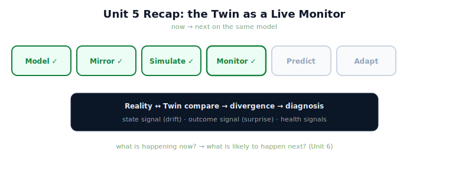

!!! abstract "You are here"
    **Module 10 — Digital Twin Capstone**  ·  **Unit 5 — Monitoring with the Twin**  ·  **Lesson 5.4 — Unit 5 Recap: Monitoring with the Twin**

# Lesson 5.4 — Unit 5 Recap: Monitoring with the Twin

> The twin can now watch. Unit 5 turned the mirror into a live monitor that answers "what is happening now?" by comparing reality against the twin and reading the divergence. Before Unit 6 asks "what is likely to happen *next*?", let's consolidate the monitor.

---

## 1. Why This Matters
Monitoring is the first of the twin's three "put it to work" capabilities, and it sets the pattern for the other two: take a question about the real system, and answer it by *running or comparing the twin you already have* — no new theory. Consolidating monitoring fixes that pattern and the tools it rests on (the divergence signals from Installments A and B), which prediction (Unit 6) and adaptation (Unit 7) will reuse. It also sharpens the central framing: a monitor answers *now*; a predictor answers *next* — same model, different question.

## 2. Physical Intuition
The conductor (now watching) is about to become the conductor (anticipating). In Unit 5 the conductor followed the score against the live performance, catching divergences as they happened — *what is happening now?* In Unit 6 the same conductor will read a few bars ahead to anticipate a tricky entry — *what is about to happen?* Same score, same musicianship; the difference is the tense of the question.

## 3. Mathematical Foundations
Unit 5 in three results:

- **Monitoring = comparison** (5.1): hold the twin's state beside reality's report; divergence is the signal; the question is **"what is happening now?"**
- **Divergence has two forms** (5.2): **state** divergence (`twin.divergence`, snapshot vs report — staleness/drift) and **outcome** divergence (`outcome_gap`, predicted vs actual harvest — surprising behaviour). Both built earlier.
- **Divergence → diagnosis** (5.3): because divergence is **localised** (which fruit/joint) and **directional** (optimistic/pessimistic), composing it with Module 9's **health signals** yields a specific account of *what happened*, not just *that* something did.

**Output of Unit 5:** the twin is a **live monitor** — it surfaces and localises departures from expectation, using only existing signals. **The turn ahead:** Unit 6 runs the same twin *forward* to answer **"what is likely to happen next?"** — monitoring's present-tense question becomes prediction's future-tense one, on the same model.

## 4. Visual Explanation

<figure markdown>
  { width="680" }
</figure>

## 5. Engineering Example
What the twin can do after Unit 5: sync to the deployed harvester and watch it live. As long as reality's reports match the twin, the monitor is quiet. When reality drifts, the *state* signal rises (re-syncable). When reality behaves unexpectedly — a fruit skipped that the twin predicted harvested — the *outcome* signal fires, localised and directional, and together with the health signals it yields a diagnosis ("likely obstruction at F3"). All of it from the divergence tools the twin already had. The one thing the monitor cannot do is tell you what's coming — which is Unit 6.

## 6. Worked Example
Self-test, answered. *Question:* a monitor reports (state divergence: near zero) and (outcome divergence: F3 predicted-harvested / actually-skipped, effort high on F3). What's the diagnosis, and what can the monitor *not* tell you? *Answer:* The twin is not stale (state quiet), but reality behaved unexpectedly on F3 — an optimistic outcome divergence with a high-effort signature, diagnosing a likely obstruction or hard configuration at F3 (an unmodeled effect localised there). What the monitor cannot tell you is what will happen *next* — whether the rest of the harvest will complete, or whether a candidate change would help. Those are forward-looking questions, and answering them is Unit 6's job: run the same twin ahead.

## 7. Interactive Demonstration
*(Conceptual — previews Unit 6's Lookahead & What-If flagship.)*
A recap pass through the monitor: in-sync (quiet), drift (state signal, re-syncable), surprising behaviour (outcome signal → diagnosis) — then end on the open question Unit 6 answers: *what is likely to happen next?* The demonstration bridges now to next.

## 8. Coding Exercise

!!! tip "Run the hands-on notebook"
    `modules/module10/notebooks/lesson20_unit5_recap.ipynb` — open in JupyterLab and run **Kernel → Restart & Run All**.

*(The recap notebook checks Unit 5 end to end.)*
In one notebook: `monitor` an in-sync twin (assert no alert); move reality and assert a state-divergence alert; introduce an unmodeled effect and assert an outcome divergence localised and directional on the affected fruit. Passing this confirms the twin as a live monitor.

## 9. Knowledge Check

Formative — unlimited attempts, immediate feedback; does not affect your grade.

<iframe src="../../quizzes/module10/lesson20_quiz.html" title="Unit 5 Recap: Monitoring with the Twin knowledge check" style="width:100%;height:720px;border:1px solid #e2e8f0;border-radius:12px"></iframe>

[Open this quiz in a new tab ↗](../quizzes/module10/lesson20_quiz.html)

*(Formative — unlimited attempts, immediate feedback.)*
Mixed review of Unit 5: comparison, the two divergence signals, divergence-to-diagnosis, and the now→next shift to prediction.

## 10. Challenge Problem
Unit 6 will run the twin forward to predict. Before building it, state precisely how a *predictor* differs from the *monitor* you just built — in the question it answers, in whether it touches reality, and in what it uses the twin's simulation for. Then predict one limitation a forecast will inherit that a present-tense monitor does not face (hint: recall the sim-to-real gap). Sketch your expectation; Unit 6 will test it.

## 11. Common Mistakes
- **Conflating the two divergence signals.** State = staleness; outcome = surprising behaviour.
- **Stopping at detection.** The twin's localised divergence supports diagnosis.
- **Expecting the monitor to forecast.** Monitoring is present-tense; prediction is Unit 6.
- **Thinking monitoring added new theory.** It reused the divergence tools from Installments A and B.

## 12. Key Takeaways
- **Monitoring** is a **Reality ↔ Twin comparison** answering "**what is happening now?**", with **divergence as the signal**.
- Divergence comes in **two forms** — **state** (drift/staleness) and **outcome** (surprising behaviour) — both **reused from earlier installments**.
- Because divergence is **localised and directional**, it becomes **diagnosis** (with the health signals), not just detection.
- The monitor uses the **same model and tools** the twin already had — **no new theory**.
- Next, **Unit 6** runs the same twin **forward**: from "what is happening now?" to "**what is likely to happen next?**"

---

## AI Learning Companion
Copy any prompt into an AI assistant.

**Tutor prompt** — explain it another way
```
Quiz me on Unit 5: monitoring as comparison, the two divergence signals, and divergence-to-diagnosis. Re-explain whatever I miss, then pose the "now vs next" question.
```
**Practice prompt** — generate more exercises
```
Give me 5 mixed-review questions on monitoring with the twin (comparison, signals, diagnosis), with answers.
```
**Explore prompt** — connect it to the real world
```
Show me how digital-twin monitoring programs move from detecting divergence to diagnosing causes, and then toward forecasting.
```

## Global Learning Support
Need this lesson in another language? Copy a prompt below into an AI assistant. English is the authoritative source.

**Supported languages (initial):** English · Español · 中文 (Simplified Chinese) · Türkçe

```
I just completed Lesson 5.4 — Unit 5 Recap: Monitoring with the Twin.
Explain this lesson in Español. Keep robotics/math terminology in English where appropriate.
Then provide: a summary, three practice questions, and one challenge problem.
```
```
I just completed Lesson 5.4 — Unit 5 Recap: Monitoring with the Twin.
Explain this lesson in 中文 (Simplified Chinese). Keep robotics/math terminology in English where appropriate.
Then provide: a summary, three practice questions, and one challenge problem.
```
```
I just completed Lesson 5.4 — Unit 5 Recap: Monitoring with the Twin.
Explain this lesson in Türkçe. Keep robotics/math terminology in English where appropriate.
Then provide: a summary, three practice questions, and one challenge problem.
```

---

*Next lesson: 6.1 — Prediction as Run-Ahead Simulation (Unit 6 begins).*
