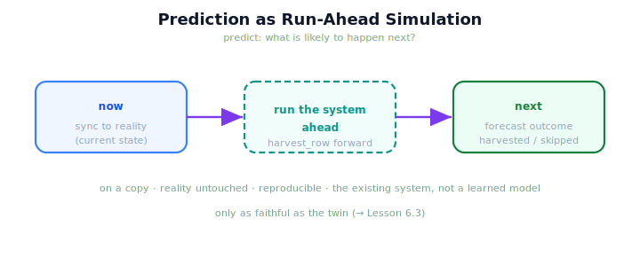

!!! abstract "You are here"
    **Module 10 — Digital Twin Capstone**  ·  **Unit 6 — Prediction with the Twin**  ·  **Lesson 6.1 — Prediction as Run-Ahead Simulation**

# Lesson 6.1 — Prediction as Run-Ahead Simulation

> Monitoring told you what is happening now. Prediction asks what is likely to happen next — and the twin answers it the only way it knows how: by running the system forward. Sync to the present, simulate into the near future, and read the likely outcome.

---

## 1. Why This Matters
Knowing what's happening now is valuable; knowing what's *about* to happen is what lets you act in time. A harvester that can foresee "this row will complete, but F3 is heading for trouble" can be steered before the trouble lands. The twin makes this possible without any new machinery: it already runs the system forward (simulation, 3.1), so prediction is simply running it forward *from the current real state* to forecast the near future. Critically, this is **not** a learned predictor or a statistical model — it is the existing Module 9 system, executed ahead inside the twin. The same model monitoring compares against is the one prediction runs forward.

## 2. Physical Intuition
Playing out the next few chess moves in your head. You don't consult a statistical model of "games like this"; you take the current board (the present state) and *play the moves forward* in imagination to see where they lead. Prediction with the twin is that mental run-ahead made literal: take reality's current state, run the system forward in the twin, and see the likely result. The forecast comes from *executing the rules forward*, not from pattern-matching past games.

## 3. Mathematical Foundations
Prediction is **simulation anchored to the present**. Sync the twin to reality's current report, then run the system forward:

$$\text{forecast} = \texttt{harvest\_row}\big(w_{\text{twin}} \leftarrow s_{\text{real, now}}\big),$$

i.e. sync ($w_{\text{twin}} \leftarrow s_{\text{real, now}}$) then simulate (3.1). The result is a **forecast** of the near-future outcome — which fruit are likely harvested, which skipped, how the harvest is likely to complete — computed by *running the existing system ahead*, on a copy, with reality untouched. What prediction is **not**:

- **not machine learning** — nothing is trained on data;
- **not a statistical/predictive model** — no curve is fit to past harvests;
- **not adaptive control** — the controller is not changed.

Prediction comes from **executing the existing system inside the twin** — the same `harvest_row` monitoring compares against, now run forward instead of compared. Two anchors keep it honest. (1) It is **anchored to the present** via the sync, so it forecasts *this* situation, not a generic one. (2) It inherits every property of simulation — safe (on a copy), reproducible (determinism), and **only as faithful as the twin** (the sim-to-real gap, which Lesson 6.3 confronts). The monitor's question "what is happening now?" becomes the predictor's "what is likely to happen next?" — same model, future tense.

## 4. Visual Explanation

<figure markdown>
  { width="680" }
</figure>

## 5. Engineering Example
Forecasting a harvest. The robot is partway down a row. Sync the twin to its current reported state and run the system ahead: the twin forecasts that the remaining ripe reachable fruit will be harvested and the row will complete. That is a *prediction* — produced by running the existing harvester forward from now, on a copy, with the real robot untouched. It used no learned model and changed no controller; it simply played the system forward. If the forecast had instead shown a fruit heading for a skip, you'd have warning in time to act — which is exactly what Lesson 6.2's lookahead and what-if build on.

## 6. Worked Example
Why must a prediction be *anchored to the present* (synced to reality's current state) rather than run from the twin's initial state? Reasoning: a forecast is useful only if it's about the situation reality is *actually* in. Running the twin from a stale or initial state would forecast a *different* situation than the one unfolding — the prediction would answer "what happens from there?" when you asked "what happens next from *here*?" Syncing first anchors the run-ahead to the present real state, so the forecast is about the actual current harvest. This is the one thing that distinguishes prediction from a generic simulation: prediction is simulation *from now*. (It still inherits simulation's caveat — the forecast is only as faithful as the twin, per 6.3.)

## 7. Interactive Demonstration

<iframe src="../../demos/module10/lesson21_run_ahead_prediction.html" title="Prediction as Run-Ahead Simulation interactive demo" style="width:100%;height:520px;border:1px solid #e2e8f0;border-radius:12px"></iframe>

[Open this demo in a new tab ↗](../demos/module10/lesson21_run_ahead_prediction.html)

*(Conceptual — previews Lesson 6.2's Lookahead & What-If flagship.)*
Sync the twin to a mid-harvest state and run it ahead to a forecast; see the likely harvested/skipped outcome appear, with reality untouched. Re-run to confirm the forecast is reproducible. The demonstration shows prediction as run-ahead simulation anchored to the present.

## 8. Coding Exercise

!!! tip "Run the hands-on notebook"
    `modules/module10/notebooks/lesson21_prediction_runahead.ipynb` — open in JupyterLab and run **Kernel → Restart & Run All**.

*(The notebook runs a prediction.)*
Use `predict(twin, sync_report=real_report)` to sync-then-run-ahead; assert it returns a forecast outcome (harvested, skipped, complete) computed on a copy with reality untouched, and that it is reproducible under a fixed seed. This establishes prediction as run-ahead simulation from the present.

## 9. Knowledge Check

Formative — unlimited attempts, immediate feedback; does not affect your grade.

<iframe src="../../quizzes/module10/lesson21_quiz.html" title="Prediction as Run-Ahead Simulation knowledge check" style="width:100%;height:720px;border:1px solid #e2e8f0;border-radius:12px"></iframe>

[Open this quiz in a new tab ↗](../quizzes/module10/lesson21_quiz.html)

*(Formative — unlimited attempts, immediate feedback.)*
Confirm that prediction is run-ahead simulation anchored to the present, that it is NOT learning/statistics/adaptive control, that it reuses the same model monitoring compares against, and why it must be synced to now.

## 10. Challenge Problem
Prediction and monitoring use the *same* twin model but answer different questions. Lay out, in a small table, how they differ along: the question (now vs next), the direction of use (compare vs run-forward), whether reality is touched, and the chief limitation each faces. Then state the one property they share that makes both possible. Keep it conceptual — no new method.

## 11. Common Mistakes
- **Thinking prediction needs a learned model.** It's run-ahead simulation — executing the existing system forward.
- **Forecasting from a stale state.** Sync to the present first, or you forecast the wrong situation.
- **Confusing predict with adaptive control.** Prediction changes nothing; it runs the existing system ahead.
- **Forgetting the gap.** A forecast is only as faithful as the twin (Lesson 6.3).

## 12. Key Takeaways
- **Prediction** answers "**what is likely to happen next?**" by **run-ahead simulation** from the **current synced state**.
- It is **not** machine learning, a statistical/predictive model, or adaptive control — it **executes the existing system** in the twin.
- It **reuses the same model monitoring compares against**, now run **forward** instead of compared.
- It must be **anchored to the present** (synced to now) to forecast the actual situation.
- It inherits simulation's properties: **safe**, **reproducible**, and **only as faithful as the twin** (6.3).

---

## AI Learning Companion
Copy any prompt into an AI assistant.

**Tutor prompt** — explain it another way
```
Re-explain Lesson 6.1 with playing the next few chess moves forward in your head from the current board — not consulting a statistical model of past games.
```
**Practice prompt** — generate more exercises
```
Give me 4 exercises distinguishing run-ahead prediction from learned/statistical forecasting, with answers.
```
**Explore prompt** — connect it to the real world
```
Show me how digital twins forecast near-future behaviour by running the asset's own model forward rather than training a predictor.
```

## Global Learning Support
Need this lesson in another language? Copy a prompt below into an AI assistant. English is the authoritative source.

**Supported languages (initial):** English · Español · 中文 (Simplified Chinese) · Türkçe

```
I just completed Lesson 6.1 — Prediction as Run-Ahead Simulation.
Explain this lesson in Español. Keep robotics/math terminology in English where appropriate.
Then provide: a summary, three practice questions, and one challenge problem.
```
```
I just completed Lesson 6.1 — Prediction as Run-Ahead Simulation.
Explain this lesson in 中文 (Simplified Chinese). Keep robotics/math terminology in English where appropriate.
Then provide: a summary, three practice questions, and one challenge problem.
```
```
I just completed Lesson 6.1 — Prediction as Run-Ahead Simulation.
Explain this lesson in Türkçe. Keep robotics/math terminology in English where appropriate.
Then provide: a summary, three practice questions, and one challenge problem.
```

---

*Next lesson: 6.2 — Lookahead and What-If (with the Installment-C flagship demo).*
