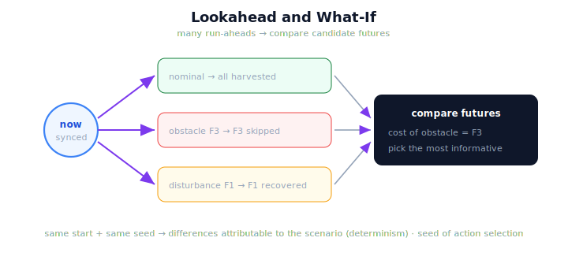

!!! abstract "You are here"
    **Module 10 — Digital Twin Capstone**  ·  **Unit 6 — Prediction with the Twin**  ·  **Lesson 6.2 — Lookahead and What-If**

# Lesson 6.2 — Lookahead and What-If

> One run-ahead tells you the likely future. *Many* run-aheads let you choose among futures. Lookahead foresees a problem in time to act; what-if compares candidate scenarios side by side. Both are just simulation, run forward, more than once.

---

## 1. Why This Matters
A single forecast is useful; the ability to compare *several* possible futures is powerful. **Lookahead** runs the system far enough ahead to catch a problem while there's still time to respond — foreseeing that a fruit is heading for a skip, say. **What-if** runs *multiple* candidate scenarios and compares their outcomes, so you can ask "would an obstacle here cost me that fruit?" or "which situation harvests more?" *before* committing. Because each run-ahead is safe (on a copy) and reproducible (determinism), you can explore many futures cheaply and pick the one that tells you the most. This is the bridge from prediction (Unit 6) to adaptation (Unit 7): comparing futures is how you'll later *choose* an action.

## 2. Physical Intuition
A chess player considering several candidate moves. Strong play isn't forecasting one line — it's playing out *several* candidate moves a few steps ahead and comparing where each leads, then choosing. Lookahead is seeing far enough down a line to spot the trap; what-if is comparing the lines. The player runs the rules forward, repeatedly, on an imagined board — never a statistical model of past games. The twin's lookahead and what-if are exactly this, made literal and reproducible.

## 3. Mathematical Foundations
Lookahead and what-if are **repeated run-ahead**. Starting from the current synced state, each candidate scenario $\text{inj}_k$ is simulated forward and its outcome recorded:

$$\text{futures} = \big\{\, k \mapsto \texttt{harvest\_row}(w_{\text{twin}},\ \text{inj}_k)\ \big\},$$

and the outcomes are compared (e.g. via the outcome gap, 4.2) to see how the candidate futures differ. **Lookahead** is the special case of running a single scenario far enough ahead to reveal a future event (a skip, a completion) while there is still time to respond. **What-if** is the general case: several scenarios, compared. Because every run is **safe** (on a copy, reality untouched), **reproducible** (same seed → same future), and **uses the existing system** (no learned predictor), you can enumerate and compare as many futures as you like and select the most informative. This is still strictly **run-ahead** — *no machine learning, no statistical forecast, no adaptive control*. The only new idea over 6.1 is *multiplicity*: running the forecast more than once, with different scenarios, and comparing. That multiplicity is precisely what makes lookahead a *decision* tool — and what Unit 7 will turn into action selection.

## 4. Visual Explanation

<figure markdown>
  { width="680" }
</figure>

## 5. Engineering Example
Comparing two futures before acting. From the current state, run two what-ifs in the twin: a *nominal* scenario (no extra effect) and an *obstacle-on-F3* scenario. The nominal future harvests F3; the obstacle future skips it. Comparing the two outcomes (via the outcome gap) shows precisely what the obstacle would cost: one fruit, F3. That comparison — produced by running the existing system forward twice, safely and reproducibly — is a decision input: it quantifies the stakes of a possible future *before* it happens. Lookahead, meanwhile, is the same machinery run far enough ahead to catch the F3 skip in time to do something about it (Unit 7).

## 6. Worked Example
You run three what-if futures from the same synced state and seed: nominal (harvests all), obstacle-on-F3 (skips F3), disturbance-on-F1 (recovers F1 in extra attempts). How do you compare them, and what makes the comparison *trustworthy*? Reasoning: compare each future's outcome against the nominal using the outcome gap — obstacle-on-F3 shows F3 skipped-only-in-that-future (cost: one fruit); disturbance-on-F1 shows F1 with extra attempts but still harvested (cost: effort, not a fruit). The comparison is trustworthy because all three runs share the **same synced start and the same seed**, so any difference between futures is attributable to the *scenario*, not to randomness (determinism, 3.3). This is why reproducibility matters for what-if: without it, you couldn't tell whether a future differed because of the scenario or because of noise.

## 7. Interactive Demonstration

<iframe src="../../demos/module10/lesson22_lookahead_whatif.html" title="Lookahead and What-If interactive demo" style="width:100%;height:520px;border:1px solid #e2e8f0;border-radius:12px"></iframe>

[Open this demo in a new tab ↗](../demos/module10/lesson22_lookahead_whatif.html)

*(This lesson ships the Installment-C flagship: the **Lookahead & What-If Explorer**.)*
From a current state, launch several what-if run-aheads — nominal and a few candidate effects — and watch each forecast outcome appear side by side, with a comparison panel showing which fruit each future costs and how the harvests rank. Toggle scenarios, re-run (identical under the same seed), and look ahead to catch a skip before it happens. The demo makes "compare candidate futures by running the existing system forward" tangible — and previews choosing among them (Unit 7).

## 8. Coding Exercise

!!! tip "Run the hands-on notebook"
    `modules/module10/notebooks/lesson22_lookahead_whatif.ipynb` — open in JupyterLab and run **Kernel → Restart & Run All**.

*(The notebook compares candidate futures.)*
Use `compare_futures(twin, {...})` to run several what-if scenarios from the current state; assert the nominal future harvests a fruit that the obstacle future skips, and that re-running under the same seed reproduces the futures exactly. This verifies lookahead/what-if as reproducible repeated run-ahead.

## 9. Knowledge Check

Formative — unlimited attempts, immediate feedback; does not affect your grade.

<iframe src="../../quizzes/module10/lesson22_quiz.html" title="Lookahead and What-If knowledge check" style="width:100%;height:720px;border:1px solid #e2e8f0;border-radius:12px"></iframe>

[Open this quiz in a new tab ↗](../quizzes/module10/lesson22_quiz.html)

*(Formative — unlimited attempts, immediate feedback.)*
Confirm that lookahead foresees an event in time to act, that what-if compares candidate futures by repeated run-ahead, that comparison is trustworthy because of determinism, and that it adds no learning/statistics.

## 10. Challenge Problem
What-if comparison is the seed of action selection (Unit 7): comparing futures is how you'll choose what to do. Describe how you would turn a set of compared futures into a *decision* (which scenario to prefer), and name the one thing you must remember about every forecast before you trust the decision (hint: 6.3). Keep it conceptual — no optimizer, no learning.

## 11. Common Mistakes
- **Running one future when you need several.** What-if is about *comparing* candidate futures.
- **Comparing futures with different seeds.** Hold the seed fixed so differences are attributable to the scenario.
- **Treating what-if as learning.** It's repeated run-ahead of the existing system — nothing is trained.
- **Trusting a future blindly.** Every forecast inherits the sim-to-real gap (6.3).

## 12. Key Takeaways
- **Lookahead** runs far enough ahead to **foresee an event in time to act**; **what-if** runs **several candidate futures** and compares them.
- Both are **repeated run-ahead** — running the existing system forward more than once, with different scenarios.
- Comparison is **trustworthy because of determinism** (same start + seed → differences are attributable to the scenario).
- It adds **no machine learning, statistics, or adaptive control**.
- Comparing futures is the **seed of action selection** — the bridge to Unit 7 (Adaptation).

---

## AI Learning Companion
Copy any prompt into an AI assistant.

**Tutor prompt** — explain it another way
```
Re-explain Lesson 6.2 with a chess player playing several candidate moves a few steps ahead and comparing where each leads.
```
**Practice prompt** — generate more exercises
```
Give me 4 what-if comparisons (run several futures, compare outcomes) and have me say what each future costs. With answers.
```
**Explore prompt** — connect it to the real world
```
Show me how digital twins use what-if/lookahead simulation to compare scenarios before committing to an action.
```

## Global Learning Support
Need this lesson in another language? Copy a prompt below into an AI assistant. English is the authoritative source.

**Supported languages (initial):** English · Español · 中文 (Simplified Chinese) · Türkçe

```
I just completed Lesson 6.2 — Lookahead and What-If.
Explain this lesson in Español. Keep robotics/math terminology in English where appropriate.
Then provide: a summary, three practice questions, and one challenge problem.
```
```
I just completed Lesson 6.2 — Lookahead and What-If.
Explain this lesson in 中文 (Simplified Chinese). Keep robotics/math terminology in English where appropriate.
Then provide: a summary, three practice questions, and one challenge problem.
```
```
I just completed Lesson 6.2 — Lookahead and What-If.
Explain this lesson in Türkçe. Keep robotics/math terminology in English where appropriate.
Then provide: a summary, three practice questions, and one challenge problem.
```

---

*Next lesson: 6.3 — The Limits of Prediction.*
