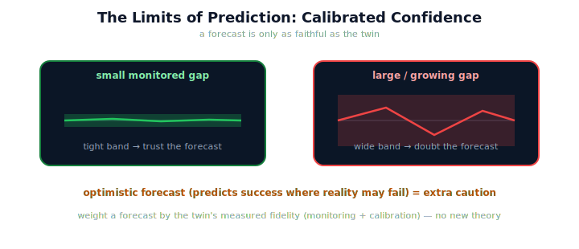

!!! abstract "You are here"
    **Module 10 — Digital Twin Capstone**  ·  **Unit 6 — Prediction with the Twin**  ·  **Lesson 6.3 — The Limits of Prediction**

# Lesson 6.3 — The Limits of Prediction

> Prediction is the twin's most seductive power — and its most dangerous if taken on faith. A forecast is a simulation, so everything the first half of the module said about the sim-to-real gap applies to it. The skill is not blind prediction; it is *calibrated* prediction.

---

## 1. Why This Matters
A forecast you trust beyond the twin's fidelity is worse than no forecast — it can send you confidently toward the wrong action. Because prediction is run-ahead *simulation*, it inherits the **sim-to-real gap**: wherever the twin fails to model an effect reality carries, the forecast can be wrong, sometimes confidently so. The responsible use of prediction is therefore *calibrated confidence*: weight a forecast by how faithful the twin is in the relevant regime, using the monitoring signals and calibration tools you already built. This lesson is the conscience of Unit 6 — it keeps the twin's forecasting power honest, and it is what makes the back half of the module safe.

## 2. Physical Intuition
A weather forecast you trust by its track record, not blindly. You don't treat tomorrow's forecast as certainty; you weight it by how the model has been doing lately and how stable the conditions are. A forecast in calm, well-understood conditions earns more trust than one during a chaotic front the model handles poorly. Predicting with the twin is the same: trust the forecast more where the twin has been matching reality (small monitored gap) and less where it hasn't or where the situation is one the twin is known not to model.

## 3. Mathematical Foundations
A prediction is a simulation, so it carries the **sim-to-real gap** (4.1). If the twin's world differs from reality by an unmodeled effect $\varepsilon$, then the forecast differs from the real outcome by exactly the effect of $\varepsilon$:

$$\text{forecast} = \texttt{harvest\_row}(w_{\text{twin}}), \quad \text{reality} = \texttt{harvest\_row}(w_{\text{twin}} \oplus \varepsilon) \;\Rightarrow\; \text{forecast error} \sim \varepsilon.$$

So a forecast is **only as faithful as the twin**. **Calibrated confidence** is the disciplined response, assembled from tools already in hand:

- **Monitor the gap** (Unit 5): a small, stable Reality ↔ Twin divergence means the twin is currently faithful — forecasts earn more trust; a large or growing divergence means forecasts should be doubted.
- **Calibrate** (4.3): modeling a known effect shrinks the gap and raises forecast trust *for that effect* — but the residual always remains, so trust is never total.
- **Direction matters** (4.2): an *optimistic* forecast (predicts success where reality may fail) is the riskier kind to act on than a pessimistic one.

No new theory is added: the limits of prediction are the sim-to-real gap, re-read as a *confidence bound on forecasts*. The rule of thumb: **trust a forecast in proportion to the twin's measured fidelity in the relevant regime, and treat optimistic forecasts with extra caution.** Prediction is powerful *because* it is paired with this humility — not in spite of it.

## 4. Visual Explanation

<figure markdown>
  { width="680" }
</figure>

## 5. Engineering Example
Trusting two forecasts differently. The twin forecasts the rest of a row will harvest cleanly. Case 1: the monitor shows the twin and reality have been matching closely (small, stable divergence) and the relevant effects are calibrated — you trust the forecast and let the harvest proceed. Case 2: the monitor shows a growing divergence, or the forecast is optimistic about a fruit where reality has recently surprised you — you treat the forecast with caution, perhaps verifying on the real system or re-calibrating first. Same forecasting machinery, different trust — set by the *measured* fidelity of the twin, not by faith in the forecast.

## 6. Worked Example
Two forecasts both say "F3 will be harvested." For forecast A, the monitor reports the twin has matched reality closely and F3's region is calibrated; for forecast B, the monitor reports a recent unexplained outcome divergence on F3. Which forecast do you trust more, and why? Reasoning: trust **A** more. A forecast is only as faithful as the twin in the relevant regime; A's regime shows a small, stable monitored gap with F3 calibrated, so the forecast rests on a faithful twin. B's regime shows a *live signal that the twin is currently wrong about F3* — exactly where this optimistic forecast ("F3 harvested") is riskiest. The monitored gap is the evidence that sets confidence; calibrated confidence means letting that evidence, not the forecast's apparent certainty, govern how much you act on it.

## 7. Interactive Demonstration
*(Conceptual — extends Lesson 6.2's Lookahead & What-If flagship.)*
Make a forecast, then vary the monitored gap: with a small gap the forecast shows a tight confidence band (trust); widen the gap and the band widens (doubt); flag an optimistic forecast for extra caution. The demonstration ties forecast trust to measured twin fidelity.

## 8. Coding Exercise

!!! tip "Run the hands-on notebook"
    `modules/module10/notebooks/lesson23_limits_of_prediction.ipynb` — open in JupyterLab and run **Kernel → Restart & Run All**.

*(The notebook shows a forecast inheriting the gap.)*
Forecast a harvest with `predict`; introduce an unmodeled effect in reality and show the forecast now differs from reality's actual outcome (the prediction inherited the gap). Then calibrate the effect and show the forecast's trust restored (gap closes). Assert the forecast-vs-reality match before/after. This verifies that forecasts are only as faithful as the twin.

## 9. Knowledge Check

Formative — unlimited attempts, immediate feedback; does not affect your grade.

<iframe src="../../quizzes/module10/lesson23_quiz.html" title="The Limits of Prediction knowledge check" style="width:100%;height:720px;border:1px solid #e2e8f0;border-radius:12px"></iframe>

[Open this quiz in a new tab ↗](../quizzes/module10/lesson23_quiz.html)

*(Formative — unlimited attempts, immediate feedback.)*
Confirm that predictions inherit the sim-to-real gap, that calibrated confidence weights a forecast by measured twin fidelity (via monitoring + calibration), that optimistic forecasts warrant extra caution, and that no new theory is added.

## 10. Challenge Problem
"Calibrated confidence" requires a way to judge twin fidelity *in the regime of the forecast*. Propose a practical rule for deciding whether a given forecast falls in a "trust" regime or a "doubt" regime, using only the monitoring signals (Unit 5) and calibration state (4.3). Then explain why an optimistic forecast deserves a stricter trust threshold than a pessimistic one. Keep it conceptual.

## 11. Common Mistakes
- **Trusting a forecast blindly.** A prediction is only as faithful as the twin.
- **Ignoring the monitored gap.** It's the evidence that should set forecast confidence.
- **Treating optimistic and pessimistic forecasts alike.** Optimistic forecasts are riskier to act on.
- **Assuming calibration removes the limit.** It shrinks the gap per-effect; a residual always remains.

## 12. Key Takeaways
- A **prediction is a simulation**, so it **inherits the sim-to-real gap** — a forecast is **only as faithful as the twin**.
- **Calibrated confidence:** trust a forecast in proportion to the twin's **measured fidelity** in the relevant regime.
- Use **monitoring** (gap small & stable → trust) and **calibration** (shrinks the gap per-effect) to set that confidence.
- **Optimistic** forecasts (predict success where reality may fail) deserve **extra caution**.
- Prediction is powerful **because it is paired with humility** — no new theory, just the gap re-read as a confidence bound.

---

## AI Learning Companion
Copy any prompt into an AI assistant.

**Tutor prompt** — explain it another way
```
Re-explain Lesson 6.3 with weather forecasts trusted by track record and conditions, not blindly — calibrated confidence.
```
**Practice prompt** — generate more exercises
```
Give me 4 forecast scenarios and have me decide how much to trust each using the monitored gap and calibration state. With answers.
```
**Explore prompt** — connect it to the real world
```
Show me how digital-twin practitioners bound trust in twin forecasts using validation against the real asset.
```

## Global Learning Support
Need this lesson in another language? Copy a prompt below into an AI assistant. English is the authoritative source.

**Supported languages (initial):** English · Español · 中文 (Simplified Chinese) · Türkçe

```
I just completed Lesson 6.3 — The Limits of Prediction.
Explain this lesson in Español. Keep robotics/math terminology in English where appropriate.
Then provide: a summary, three practice questions, and one challenge problem.
```
```
I just completed Lesson 6.3 — The Limits of Prediction.
Explain this lesson in 中文 (Simplified Chinese). Keep robotics/math terminology in English where appropriate.
Then provide: a summary, three practice questions, and one challenge problem.
```
```
I just completed Lesson 6.3 — The Limits of Prediction.
Explain this lesson in Türkçe. Keep robotics/math terminology in English where appropriate.
Then provide: a summary, three practice questions, and one challenge problem.
```

---

*Next lesson: 6.4 — Unit 6 Recap (monitor answers 'now', predict answers 'next' — same model; next, adaptation).*
