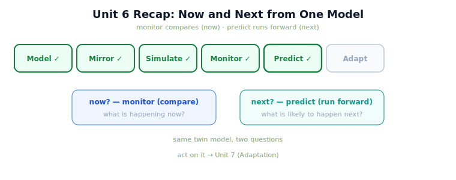

!!! abstract "You are here"
    **Module 10 — Digital Twin Capstone**  ·  **Unit 6 — Prediction with the Twin**  ·  **Lesson 6.4 — Unit 6 Recap: Prediction with the Twin**

# Lesson 6.4 — Unit 6 Recap: Prediction with the Twin

> The twin can now look ahead. Unit 6 turned simulation into foresight: forecast the near future, compare candidate futures, and trust the forecast only as far as the twin is faithful. With monitoring (now) and prediction (next) in hand, only one step remains — acting on what the twin tells you.

---

## 1. Why This Matters
Prediction completes the twin's sensing half: with Unit 5 it perceives the present, with Unit 6 it anticipates the near future — both from the *same* model, run differently. Consolidating prediction fixes the run-ahead pattern (sync to now, simulate forward), the what-if pattern (compare candidate futures), and the discipline that keeps both safe (calibrated confidence). All three feed directly into Unit 7, where comparing futures becomes *choosing* an action. This recap also crystallises the module's neatest symmetry: a monitor asks "what is happening now?", a predictor asks "what is likely to happen next?", and the twin answers both with one underlying model.

## 2. Physical Intuition
The conductor now hears the present *and* anticipates the next bars. Unit 5 gave the conductor live awareness of the performance; Unit 6 gave them the read-ahead to anticipate a tricky entry. Same score, same ear — present awareness and near-future anticipation. Unit 7 is the downbeat: acting on what they hear and foresee.

## 3. Mathematical Foundations
Unit 6 in three results:

- **Prediction = run-ahead** (6.1): sync to the present, then `harvest_row` forward → a forecast of the near future. *Not* learning/statistics/adaptive control — the existing system, executed ahead.
- **Lookahead & what-if** (6.2): repeated run-ahead — foresee an event in time to act, and compare candidate futures (trustworthy because of determinism). The seed of action selection.
- **Limits of prediction** (6.3): a forecast inherits the **sim-to-real gap**, so trust it with **calibrated confidence** — weighted by the twin's measured fidelity (monitoring + calibration), with optimistic forecasts treated cautiously.

**The now/next symmetry:** monitoring (Unit 5) **compares** the twin to reality → *what is happening now?*; prediction (Unit 6) **runs the twin forward** → *what is likely to happen next?* **Same model, two questions.** **Output:** the twin now both perceives and anticipates. **The turn ahead:** Unit 7 (Adaptation) *acts* on these answers — using what-if comparison to choose and pre-validate an action, closing the twin-in-the-loop.

## 4. Visual Explanation

<figure markdown>
  { width="680" }
</figure>

## 5. Engineering Example
What the twin can do after Unit 6: sync to the deployed harvester and forecast the rest of the row; run what-ifs to compare candidate futures ("would an obstacle here cost F3?"); and set how much to trust each forecast by the monitored gap and calibration state. The twin now answers both "what is happening now?" (Unit 5) and "what is likely to happen next?" (Unit 6) from one model — perception and anticipation. The only thing it cannot yet do is *act* on these answers: choose and pre-validate a response. That is Unit 7.

## 6. Worked Example
Self-test, answered. *Question:* monitoring and prediction use the same twin model — so what exactly distinguishes them, and what single property makes both possible? *Answer:* They differ in (i) the *question* — now vs next; (ii) the *direction of use* — monitoring *compares* the twin's state to reality, prediction *runs* the twin forward; and (iii) reality — monitoring reads reality's live report, prediction runs on a copy with reality untouched. The single property that makes both possible is that the twin **runs the existing Module 9 system** — comparing against it gives monitoring, running it forward gives prediction. One model, two uses; and both inherit the same limit (fidelity to reality), which is why calibrated confidence applies to forecasts and informed interpretation applies to monitor signals.

## 7. Interactive Demonstration

<iframe src="../../demos/module10/lesson24_unit6_recap.html" title="Unit 6 Recap: Prediction with the Twin interactive demo" style="width:100%;height:520px;border:1px solid #e2e8f0;border-radius:12px"></iframe>

[Open this demo in a new tab ↗](../demos/module10/lesson24_unit6_recap.html)

*(Conceptual — recaps Lesson 6.2's Lookahead & What-If flagship.)*
A recap pass: forecast the near future (run-ahead), compare a few candidate futures (what-if), and set trust by the monitored gap (calibrated confidence) — then end on the open question Unit 7 answers: *now that you can foresee it, what will you do about it?* The demonstration bridges prediction to adaptation.

## 8. Coding Exercise

!!! tip "Run the hands-on notebook"
    `modules/module10/notebooks/lesson24_unit6_recap.ipynb` — open in JupyterLab and run **Kernel → Restart & Run All**.

*(The recap notebook checks Unit 6 end to end.)*
In one notebook: `predict` a forecast from a synced state (assert a reproducible forecast, reality untouched); `compare_futures` over nominal vs an effect (assert they differ on the affected fruit); and show a forecast inheriting then shedding the gap via `calibrate` (assert match restored). Passing this confirms run-ahead, what-if, and calibrated confidence.

## 9. Knowledge Check

Formative — unlimited attempts, immediate feedback; does not affect your grade.

<iframe src="../../quizzes/module10/lesson24_quiz.html" title="Unit 6 Recap: Prediction with the Twin knowledge check" style="width:100%;height:720px;border:1px solid #e2e8f0;border-radius:12px"></iframe>

[Open this quiz in a new tab ↗](../quizzes/module10/lesson24_quiz.html)

*(Formative — unlimited attempts, immediate feedback.)*
Mixed review of Unit 6: run-ahead prediction, lookahead/what-if, the limits of prediction, and the now/next symmetry with monitoring.

## 10. Challenge Problem
Unit 7 will *act* on the twin's foresight: use what-if comparison to choose an action and pre-validate it before committing on the real robot. Before building it, sketch the loop: from a monitored divergence (now) → a set of compared futures (next) → a chosen, pre-validated action. Name where the sim-to-real gap enters this loop and how calibrated confidence guards it. Unit 7 will put your sketch to the test.

## 11. Common Mistakes
- **Treating prediction as learning.** It's run-ahead of the existing system — nothing is trained.
- **Forecasting from a stale state.** Sync to now first.
- **Trusting forecasts blindly.** Weight them by the twin's measured fidelity (calibrated confidence).
- **Expecting the predictor to act.** Acting on foresight is Unit 7.

## 12. Key Takeaways
- **Prediction** is **run-ahead simulation** from the present — "**what is likely to happen next?**" — using the existing system, not learning.
- **Lookahead & what-if** run it forward repeatedly to **foresee events** and **compare candidate futures** (the seed of action selection).
- A forecast **inherits the sim-to-real gap** — trust it with **calibrated confidence** (monitoring + calibration), cautious of optimistic forecasts.
- **Now/next symmetry:** monitoring **compares** (now), prediction **runs forward** (next) — **same model, two questions**.
- Next, **Unit 7** *acts* on these answers, closing the **twin-in-the-loop**.

---

## AI Learning Companion
Copy any prompt into an AI assistant.

**Tutor prompt** — explain it another way
```
Quiz me on Unit 6: run-ahead prediction, lookahead/what-if, and the limits of prediction. Re-explain whatever I miss, then pose the "now you can foresee it — what will you do?" question.
```
**Practice prompt** — generate more exercises
```
Give me 5 mixed-review questions on prediction with the twin (run-ahead, what-if, calibrated confidence), with answers.
```
**Explore prompt** — connect it to the real world
```
Show me how digital twins combine live monitoring and forward prediction from one model, and how teams decide how much to trust forecasts.
```

## Global Learning Support
Need this lesson in another language? Copy a prompt below into an AI assistant. English is the authoritative source.

**Supported languages (initial):** English · Español · 中文 (Simplified Chinese) · Türkçe

```
I just completed Lesson 6.4 — Unit 6 Recap: Prediction with the Twin.
Explain this lesson in Español. Keep robotics/math terminology in English where appropriate.
Then provide: a summary, three practice questions, and one challenge problem.
```
```
I just completed Lesson 6.4 — Unit 6 Recap: Prediction with the Twin.
Explain this lesson in 中文 (Simplified Chinese). Keep robotics/math terminology in English where appropriate.
Then provide: a summary, three practice questions, and one challenge problem.
```
```
I just completed Lesson 6.4 — Unit 6 Recap: Prediction with the Twin.
Explain this lesson in Türkçe. Keep robotics/math terminology in English where appropriate.
Then provide: a summary, three practice questions, and one challenge problem.
```

---

*Installment C complete. Next: Installment D — Adaptation (closing the twin-in-the-loop) and the Digital Twin Capstone & Curriculum Close.*
