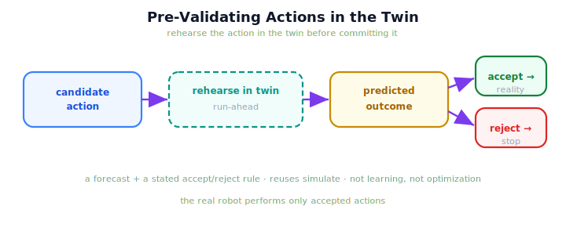

!!! abstract "You are here"
    **Module 10 — Digital Twin Capstone**  ·  **Unit 7 — Adaptation: Closing the Twin-in-the-Loop**  ·  **Lesson 7.1 — Pre-Validating Actions in the Twin**

# Lesson 7.1 — Pre-Validating Actions in the Twin

> The last verb in the spine is *Adapt*, and it starts with a simple discipline: don't commit an action to the real robot until you've rehearsed it in the twin. Pre-validation turns the twin from an observer into an advisor.

---

## 1. Why This Matters
A deployed harvester that commits every planned action blindly will sometimes drive into trouble it could have foreseen — reaching for a fruit behind an obstacle, repeating a pick that will never succeed. The twin already lets you run the existing system forward (Unit 6). Pre-validation puts that forecast to work as a gate: rehearse the action in the twin, look at the predicted outcome, and only commit it to reality if the rehearsal looks acceptable. This is the first move of *adaptation* — using the twin not just to watch and forecast, but to decide whether an action is worth taking. It costs nothing in the real world because the rehearsal happens on the twin's own copy.

## 2. Physical Intuition
A pilot in a flight simulator before a tricky approach. The simulator is the twin; the approach is the candidate action. The pilot flies it once in the sim, sees it go badly, and chooses a different approach for the real runway — no passengers were ever at risk. The simulator didn't learn anything and didn't optimize a policy; it just *ran the same aircraft model on the candidate maneuver* and showed the outcome. Pre-validating a harvest action is the same: rehearse the pick in the twin, read the result, then decide.

## 3. Mathematical Foundations
Pre-validation is a **forecast plus a verdict**, both built from pieces you already have. Let an action be a candidate scenario $a$ (a what-if inject describing what the robot would do or face). Running it forward in the twin gives a forecast:

$$\hat{o}(a) = \text{simulate}_{\text{twin}}(a),$$

which is exactly the run-ahead from Unit 6 applied to a candidate action. A **simple, explained acceptance test** $\text{ok}(\cdot)$ turns the forecast into a verdict:

$$\text{accept}(a) = \text{ok}\big(\hat{o}(a)\big),\qquad \text{ok}(o) = \big[\,o\text{ completed and skipped nothing}\,\big].$$

Three things keep this honest. (1) The forecast **reuses `simulate`** — no new theory; it is the existing system run on a candidate. (2) The acceptance test is a **plain, stated rule** a human can read and change — not a learned classifier and not an objective being optimized. (3) Pre-validation **decides nothing on its own beyond accept/reject**; choosing *among* several acceptable actions is the next lesson (7.2). The whole move is: *rehearse the action in the twin, read the predicted outcome, apply a stated rule.*

## 4. Visual Explanation

<figure markdown>
  { width="680" }
</figure>

## 5. Engineering Example
Before the arm reaches for a fruit it suspects is partly occluded, the orchestrator pre-validates the pick in the twin: it injects the suspected obstacle as a what-if and runs the harvest forward. If the twin's forecast shows that fruit skipped (the plan can't reach it), the orchestrator rejects the blind reach and refrains from wasting attempts in reality. If the forecast shows a clean pick, it commits. The real robot only ever performs rehearsed-and-accepted actions, and every rehearsal is free because it runs on the twin's copy.

## 6. Worked Example
A candidate pick is pre-validated two ways. First with no obstacle: the twin's run-ahead completes and skips nothing, so the acceptance test passes — **accept**. Then with a suspected obstacle injected on that fruit: the twin's run-ahead now shows the fruit skipped, so the test fails — **reject**. Same robot, same twin, two candidate conditions, two verdicts. Notice what did *not* happen: nothing was tuned, nothing was learned, no objective was maximized. The twin simply ran the existing harvester on each candidate and reported the outcome, and a one-line rule turned each outcome into accept or reject. That is the entire mechanism of pre-validation.

## 7. Interactive Demonstration
*(Conceptual — the Unit 8 capstone demo shows pre-validation running live.)*
Take a candidate pick, rehearse it in the twin with and without a suspected obstacle, and watch the verdict flip from accept to reject as the forecast changes. Pre-validation = forecast + a stated rule.

## 8. Coding Exercise

!!! tip "Run the hands-on notebook"
    `modules/module10/notebooks/lesson25_prevalidating_actions.ipynb` — open in JupyterLab and run **Kernel → Restart & Run All**.

*(The notebook pre-validates actions in the twin.)*
Sync a twin, then call `prevalidate` on a clean action and assert it is accepted (the forecast completes, nothing skipped). Pre-validate the same action with an obstacle injected and assert it is rejected (the forecast skips the blocked fruit). This shows pre-validation as run-ahead plus a stated acceptance test — no learning.

## 9. Knowledge Check

Formative — unlimited attempts, immediate feedback; does not affect your grade.

<iframe src="../../quizzes/module10/lesson25_quiz.html" title="Pre-Validating Actions in the Twin knowledge check" style="width:100%;height:720px;border:1px solid #e2e8f0;border-radius:12px"></iframe>

[Open this quiz in a new tab ↗](../quizzes/module10/lesson25_quiz.html)

*(Formative — unlimited attempts, immediate feedback.)*
Confirm that pre-validation runs a candidate action forward in the twin before committing it, uses a simple stated acceptance test, reuses `simulate` (no new theory), and is neither learning nor optimization.

## 10. Challenge Problem
Pre-validation rejects an action whose forecast skips a fruit. But the twin is imperfect (the sim-to-real gap, Unit 4). Explain how an over-trusting pre-validation could reject a *good* real action because the twin wrongly predicts failure — and how the calibration idea from 4.3 reduces that risk. Keep the reasoning about trust in the twin, not a new algorithm.

## 11. Common Mistakes
- **Treating pre-validation as optimization.** It applies a stated accept/reject rule; it does not maximize an objective.
- **Confusing it with learning.** The twin runs the existing system on a candidate — nothing is trained.
- **Forgetting the twin is imperfect.** A pre-validation verdict is only as trustworthy as the twin's calibration.
- **Committing un-rehearsed actions.** The whole point is to rehearse in the twin *before* reality.

## 12. Key Takeaways
- **Pre-validation** runs a candidate action **forward in the twin before committing it** to reality.
- It is a **forecast plus a stated acceptance test** — reusing `simulate`, with **no new theory**.
- It is **not machine learning, not RL, not optimization** — just the existing system run on a candidate.
- Rehearsing in the twin is **free**; the real robot performs only accepted actions.
- A verdict is **only as good as the twin's calibration** — pre-validation inherits the sim-to-real gap.

---

## AI Learning Companion
Copy any prompt into an AI assistant.

**Tutor prompt** — explain it another way
```
Re-explain Lesson 7.1 with a pilot rehearsing a tricky approach in a flight simulator before flying it for real — running the same aircraft on a candidate maneuver and reading the outcome.
```
**Practice prompt** — generate more exercises
```
Give me 4 candidate harvest actions; for each, decide whether a twin pre-validation would accept or reject it and why. With answers.
```
**Explore prompt** — connect it to the real world
```
Show me how real digital twins are used to rehearse or pre-validate operations (manufacturing, surgery planning, spacecraft maneuvers) before committing them to the physical asset.
```

## Global Learning Support
Need this lesson in another language? Copy a prompt below into an AI assistant. English is the authoritative source.

**Supported languages (initial):** English · Español · 中文 (Simplified Chinese) · Türkçe

```
I just completed Lesson 7.1 — Pre-Validating Actions in the Twin.
Explain this lesson in Español. Keep robotics/math terminology in English where appropriate.
Then provide: a summary, three practice questions, and one challenge problem.
```
```
I just completed Lesson 7.1 — Pre-Validating Actions in the Twin.
Explain this lesson in 中文 (Simplified Chinese). Keep robotics/math terminology in English where appropriate.
Then provide: a summary, three practice questions, and one challenge problem.
```
```
I just completed Lesson 7.1 — Pre-Validating Actions in the Twin.
Explain this lesson in Türkçe. Keep robotics/math terminology in English where appropriate.
Then provide: a summary, three practice questions, and one challenge problem.
```

---

*Next lesson: 7.2 — Twin-Informed Decisions: Choosing the Better Action.*
