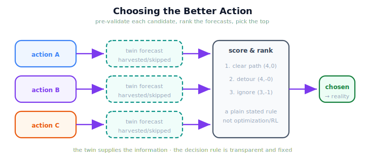

!!! abstract "You are here"
    **Module 10 — Digital Twin Capstone**  ·  **Unit 7 — Adaptation: Closing the Twin-in-the-Loop**  ·  **Lesson 7.2 — Twin-Informed Decisions: Choosing the Better Action**

# Lesson 7.2 — Twin-Informed Decisions: Choosing the Better Action

> Pre-validation answers "is this action acceptable?" The natural next question is "which of these actions is *better*?" — and the twin answers it the same way: run each candidate ahead and compare the outcomes.

---

## 1. Why This Matters
Real harvesting offers choices: attempt a tricky fruit now or come back to it, take the direct approach or a detour, retry a stuck pick or move on. A blind controller picks one and hopes. With a twin you can do better without any new machinery: pre-validate *each* candidate action (7.1), then compare the forecasts and choose the one that looks best. The twin turns a guess into an informed decision. Crucially, this stays inside the module's scope — the comparison is a plain ranking of forecasts, not an optimizer searching a space and not a policy learned from rewards.

## 2. Physical Intuition
Choosing a route with a map app that shows each option's predicted arrival time. You don't *optimize* anything — you read three predicted outcomes and pick the shortest. The map (the twin) forecasts each route (candidate action); you compare and choose. Replace 'arrival time' with 'fruit harvested, fewest skipped' and you have twin-informed action-selection: several rehearsals, one comparison, one choice.

## 3. Mathematical Foundations
Action-selection is **pre-validate-each then rank-and-pick**. Given candidate actions $\{a_1,\dots,a_k\}$ (each a what-if scenario), run each forward in the twin — this is `compare_futures` from 6.2:

$$\hat{o}(a_i) = \text{simulate}_{\text{twin}}(a_i),\quad i=1,\dots,k.$$

A **simple, explained score** orders the forecasts. A natural one for harvesting prefers more fruit picked, then fewer skipped:

$$\text{score}(o) = \big(\,|\text{harvested}(o)|,\ -|\text{skipped}(o)|\,\big),\qquad a^\star = \arg\max_i\ \text{score}\big(\hat{o}(a_i)\big),$$

where the $\arg\max$ is just "take the top of the ranked list" — a tuple comparison, not a numerical optimizer. What makes this in-scope: (1) the candidate set is **small and given**, not searched; (2) the score is a **plain, stated rule** you can read and edit, not a learned value function; (3) there is **no feedback loop updating parameters** — the twin ranks once, the robot chooses once. The twin provides the *information*; the decision rule is transparent and fixed. This is twin-informed decision-making, not optimization or RL.

## 4. Visual Explanation

<figure markdown>
  { width="680" }
</figure>

## 5. Engineering Example
Facing a fruit that may be blocked, the orchestrator weighs two actions: attempt it as planned, or skip it and continue the row. It pre-validates both in the twin. 'Attempt as planned' forecasts the fruit skipped after wasted reaches (score: three harvested, one skipped); 'skip and continue' forecasts a clean run of the rest (also strong, no wasted effort). The twin ranks them, the orchestrator chooses the better-scoring action, and only that action goes to the real robot. The decision was informed by rehearsed outcomes, not by a guess.

## 6. Worked Example
Two candidate actions are pre-validated. Candidate *clear path* forecasts four fruit harvested, none skipped → score $(4, 0)$. Candidate *ignore the obstacle* forecasts three harvested, one skipped → score $(3, -1)$. Ranking by the stated score puts *clear path* on top, so it is chosen. Now suppose the score changed — say we valued attempting every fruit regardless of waste; the ranking could flip. That is the point: the **choice follows transparently from a rule you can read**, applied to forecasts the twin produced. Nothing was optimized over a continuous space and nothing was learned from past episodes — two rehearsals, one comparison, one pick.

## 7. Interactive Demonstration

<iframe src="../../demos/module10/lesson26_twin_informed_decisions.html" title="Twin-Informed Decisions: Choosing the Better Action interactive demo" style="width:100%;height:520px;border:1px solid #e2e8f0;border-radius:12px"></iframe>

[Open this demo in a new tab ↗](../demos/module10/lesson26_twin_informed_decisions.html)

*(Conceptual — the Unit 8 capstone demo selects actions live.)*
Line up two or three candidate actions, rehearse each in the twin, and watch the ranked table pick the top one. Change the score and watch the choice change — the decision is transparent.

## 8. Coding Exercise

!!! tip "Run the hands-on notebook"
    `modules/module10/notebooks/lesson26_twin_informed_decisions.ipynb` — open in JupyterLab and run **Kernel → Restart & Run All**.

*(The notebook chooses the better action.)*
Build a small set of candidate actions (e.g. clear vs obstacle-facing), call `select_action`, and assert it ranks the better-outcome candidate first and chooses it. Then assert the per-candidate scores match the stated rule. This shows action-selection as ranked pre-validation — not optimization.

## 9. Knowledge Check

Formative — unlimited attempts, immediate feedback; does not affect your grade.

<iframe src="../../quizzes/module10/lesson26_quiz.html" title="Twin-Informed Decisions: Choosing the Better Action knowledge check" style="width:100%;height:720px;border:1px solid #e2e8f0;border-radius:12px"></iframe>

[Open this quiz in a new tab ↗](../quizzes/module10/lesson26_quiz.html)

*(Formative — unlimited attempts, immediate feedback.)*
Confirm that twin-informed decision-making pre-validates several candidate actions, ranks their forecasts with a simple stated score, chooses the top one, and is distinct from optimization, RL, and adaptive control.

## 10. Challenge Problem
The default score prefers more harvested, then fewer skipped. Propose a different stated score that also penalizes wasted attempts (effort), and describe one situation where it would choose a *different* action than the default. Explain why changing the score is still not 'optimization' in the sense the module excludes.

## 11. Common Mistakes
- **Calling it optimization.** The candidate set is given and small; you rank and pick, you don't search a space.
- **Calling it RL.** No rewards, no episodes, no learned policy — just forecasts compared once.
- **Hiding the score.** The decision rule must be readable; a hidden score makes the choice unaccountable.
- **Ranking forecasts from an un-synced twin.** Compare actions from the same, current twin state (sync first).

## 12. Key Takeaways
- **Action-selection** pre-validates **several candidates** and **chooses the better-forecast one**.
- It uses a **simple, stated score** to rank — reusing `compare_futures`, with **no new theory**.
- It is **not optimization, RL, or adaptive control**: a given set, a readable rule, one choice.
- The twin supplies the **information**; the **decision rule is transparent and fixed**.
- Change the score and the choice changes **predictably** — that is what makes it accountable.

---

## AI Learning Companion
Copy any prompt into an AI assistant.

**Tutor prompt** — explain it another way
```
Re-explain Lesson 7.2 with a map app that shows each route's predicted arrival time, so you compare the forecasts and pick the best route — no optimizing, just comparing.
```
**Practice prompt** — generate more exercises
```
Give me 4 decision situations with 2-3 candidate harvest actions each; rank them by the stated score and name the choice. With answers.
```
**Explore prompt** — connect it to the real world
```
Show me how digital twins are used in industry to compare candidate operating decisions (which valve, which schedule, which route) by simulating each before committing.
```

## Global Learning Support
Need this lesson in another language? Copy a prompt below into an AI assistant. English is the authoritative source.

**Supported languages (initial):** English · Español · 中文 (Simplified Chinese) · Türkçe

```
I just completed Lesson 7.2 — Twin-Informed Decisions: Choosing the Better Action.
Explain this lesson in Español. Keep robotics/math terminology in English where appropriate.
Then provide: a summary, three practice questions, and one challenge problem.
```
```
I just completed Lesson 7.2 — Twin-Informed Decisions: Choosing the Better Action.
Explain this lesson in 中文 (Simplified Chinese). Keep robotics/math terminology in English where appropriate.
Then provide: a summary, three practice questions, and one challenge problem.
```
```
I just completed Lesson 7.2 — Twin-Informed Decisions: Choosing the Better Action.
Explain this lesson in Türkçe. Keep robotics/math terminology in English where appropriate.
Then provide: a summary, three practice questions, and one challenge problem.
```

---

*Next lesson: 7.3 — The Twin-in-the-Loop Cycle.*
