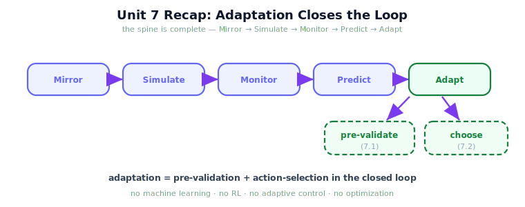

!!! abstract "You are here"
    **Module 10 — Digital Twin Capstone**  ·  **Unit 7 — Adaptation: Closing the Twin-in-the-Loop**  ·  **Lesson 7.4 — Unit 7 Recap: Adaptation and the Twin-in-the-Loop**

# Lesson 7.4 — Unit 7 Recap: Adaptation and the Twin-in-the-Loop

> Four lessons turned the twin from a forecaster into a decision partner. This recap consolidates adaptation — pre-validate, choose, close the loop — and sets up the capstone, where the whole spine runs at once.

---

## 1. Why This Matters
Unit 7 is where the twin stops merely reporting and starts *advising decisions*. Pulling the three ideas together — pre-validate an action, choose among candidates, run the closed loop — makes adaptation a single coherent capability rather than three tricks. This recap also nails down the scope line one last time, because 'adaptation' is exactly the word that tempts a slide into learning or optimization, and the module deliberately stays on the near side of that line. Consolidating here sets up the capstone (Unit 8), where monitor, predict, and adapt all run together on one harvest.

## 2. Physical Intuition
A chess player thinking a move ahead with a practice board. They try a candidate move on the practice board (pre-validate), try a couple of alternatives and keep the best (choose), and do this every turn of the real game (the loop). They are not learning a new opening and not running an engine's search to depth twenty — they are rehearsing concrete candidate moves on a copy and picking the better-looking one. That is the whole of Unit 7's adaptation.

## 3. Mathematical Foundations
Unit 7 in one frame, all reusing earlier operators:

$$\textbf{pre-validate (7.1): } \text{accept}(a) = \text{ok}\big(\text{simulate}_{\text{twin}}(a)\big)$$
$$\textbf{choose (7.2): } a^\star = \arg\max_i\ \text{score}\big(\text{simulate}_{\text{twin}}(a_i)\big)$$
$$\textbf{close the loop (7.3): } \text{monitor} \to \text{re-sync if drifted} \to \text{predict} \to \text{adapt} \to \text{act} \to \cdots$$

The **scope boundary**, restated: `ok` and `score` are **plain, stated rules**, not learned functions; the candidate set is **given and small**, not searched; there is **no parameter update from outcomes** — so this is *not* ML, RL, adaptive control, or optimization. What it *is*: the existing Module 9 system, run forward in the twin, used to **rehearse and rank actions** before committing them. With Unit 7 complete, the spine is whole — **Mirror** (sync), **Simulate**, **Monitor** (Unit 5), **Predict** (Unit 6), **Adapt** (Unit 7) — and Unit 8 runs it end to end.

## 4. Visual Explanation

<figure markdown>
  { width="680" }
</figure>

## 5. Engineering Example
By the end of Unit 7 the harvester consults its twin before every pick: rehearse the action, compare it against the alternative, choose the better one, act, and repeat — re-syncing whenever reality drifts. The same Module 9 harvester does all the real work; the twin only advises. That advisory loop is the deployable form of 'a self-improving harvest,' and the capstone in Unit 8 shows it running on a full row.

## 6. Worked Example
Connect the three lessons on one decision. A fruit may be blocked. **Pre-validate (7.1)**: rehearse 'attempt' in the twin → forecast skips the fruit → reject. **Choose (7.2)**: rehearse 'attempt' vs 'skip-and-continue', rank by score → 'skip-and-continue' wins → choose it. **Loop (7.3)**: this decision happened inside one cycle turn that also monitored for drift and re-synced if needed; next fruit, the cycle runs again. Three lessons, one fluid decision — and not a single learned parameter or optimized objective anywhere in it.

## 7. Interactive Demonstration
*(Conceptual — the capstone in 8.2 is the live demonstration of all of this.)*
Walk one decision through pre-validate → choose → loop, then note that the capstone simply runs this for every fruit in a row, with monitor and predict active throughout.

## 8. Coding Exercise

!!! tip "Run the hands-on notebook"
    `modules/module10/notebooks/lesson28_unit7_recap.ipynb` — open in JupyterLab and run **Kernel → Restart & Run All**.

*(The notebook consolidates Unit 7.)*
In one notebook: `prevalidate` (accept clean / reject blocked), `select_action` (rank and choose the better candidate), and `twin_in_the_loop` (one turn, in-sync and drifted). Assert each behaves as in its lesson. This confirms adaptation as pre-validate + choose inside the closed loop — no learning.

## 9. Knowledge Check

Formative — unlimited attempts, immediate feedback; does not affect your grade.

<iframe src="../../quizzes/module10/lesson28_quiz.html" title="Unit 7 Recap: Adaptation and the Twin-in-the-Loop knowledge check" style="width:100%;height:720px;border:1px solid #e2e8f0;border-radius:12px"></iframe>

[Open this quiz in a new tab ↗](../quizzes/module10/lesson28_quiz.html)

*(Formative — unlimited attempts, immediate feedback.)*
Confirm Unit 7's consolidation: adaptation is pre-validation plus action-selection in the twin-in-the-loop cycle; `ok`/`score` are stated rules; the candidate set is given; no ML/RL/adaptive control/optimization; the spine is now complete.

## 10. Challenge Problem
Write a one-paragraph 'scope statement' for a colleague who hears 'adaptive' and assumes the robot is *learning*. Explain precisely what Unit 7 does and does not do, using pre-validation and action-selection, and naming the four things it deliberately avoids.

## 11. Common Mistakes
- **Hearing 'adapt' as 'learn'.** Unit 7 rehearses and ranks; it never updates parameters from outcomes.
- **Skipping the loop's order.** Monitor before re-sync, re-sync before decide — every cycle.
- **Hiding the decision rule.** `ok` and `score` must stay readable to keep choices accountable.
- **Forgetting the twin's imperfection.** Every verdict and ranking inherits the sim-to-real gap.

## 12. Key Takeaways
- **Adaptation = pre-validation + action-selection**, assembled into the **twin-in-the-loop cycle**.
- It is **not ML, RL, adaptive control, or optimization** — stated rules over a given candidate set.
- Decisions reuse `simulate`/`compare_futures`/`monitor`/`sync` — **composition, not new theory**.
- The twin is a **decision partner**: it rehearses and ranks; the real robot acts.
- With Unit 7 done, the **full spine** Mirror → Simulate → Monitor → Predict → Adapt **exists** — Unit 8 runs it whole.

---

## AI Learning Companion
Copy any prompt into an AI assistant.

**Tutor prompt** — explain it another way
```
Re-explain Lesson 7.4 with a chess player using a practice board: try a candidate move, try alternatives, keep the best, every turn — without learning a new opening or running a deep engine search.
```
**Practice prompt** — generate more exercises
```
Quiz me on Unit 7: 6 questions spanning pre-validation, action-selection, the loop order, and the scope boundary. With answers.
```
**Explore prompt** — connect it to the real world
```
Show me how the term 'digital twin in the loop' is used in real engineering, and how practitioners distinguish it from learning-based or optimization-based control.
```

## Global Learning Support
Need this lesson in another language? Copy a prompt below into an AI assistant. English is the authoritative source.

**Supported languages (initial):** English · Español · 中文 (Simplified Chinese) · Türkçe

```
I just completed Lesson 7.4 — Unit 7 Recap: Adaptation and the Twin-in-the-Loop.
Explain this lesson in Español. Keep robotics/math terminology in English where appropriate.
Then provide: a summary, three practice questions, and one challenge problem.
```
```
I just completed Lesson 7.4 — Unit 7 Recap: Adaptation and the Twin-in-the-Loop.
Explain this lesson in 中文 (Simplified Chinese). Keep robotics/math terminology in English where appropriate.
Then provide: a summary, three practice questions, and one challenge problem.
```
```
I just completed Lesson 7.4 — Unit 7 Recap: Adaptation and the Twin-in-the-Loop.
Explain this lesson in Türkçe. Keep robotics/math terminology in English where appropriate.
Then provide: a summary, three practice questions, and one challenge problem.
```

---

*Next: Unit 8 — the Digital Twin Capstone and the close of the curriculum.*
