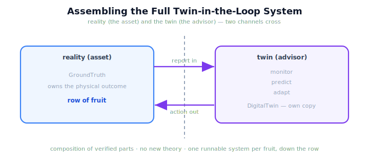

!!! abstract "You are here"
    **Module 10 — Digital Twin Capstone**  ·  **Unit 8 — Digital Twin Capstone & Curriculum Close**  ·  **Lesson 8.1 — Assembling the Full Twin-in-the-Loop System**

# Lesson 8.1 — Assembling the Full Twin-in-the-Loop System

> The capstone needs a stage to run on. This lesson builds that stage: the complete twin-in-the-loop harvester, every part from Module 10 wired into one system that runs a whole row.

---

## 1. Why This Matters
A pile of capabilities is not a system. To run the capstone you need them connected: reality producing reports, the twin mirroring them, and the cycle consuming those reports to monitor, forecast, and decide — fruit after fruit, down a whole row. This lesson does the wiring once, carefully, so the capstone is a matter of running it rather than building it. It is also where the architecture becomes legible: you can see exactly where reality ends and the twin begins, and how information flows between them. That clarity is the point of the whole module made concrete.

## 2. Physical Intuition
A mission control room going live. The spacecraft (reality) sends telemetry; the ground model (twin) mirrors it; controllers continuously compare, forecast the next maneuver, and decide. Before any mission, the room is *assembled and checked out* — every console wired to the right feed. This lesson is the checkout: connect reality's reports to the twin, the twin to the monitor, the monitor to the decision, and confirm the whole board lights up correctly before the capstone 'mission' runs.

## 3. Mathematical Foundations
The assembled system is the **cycle of 7.3 wired to a row of fruit**. For each fruit in the row, one cycle turn runs:

$$s^{\text{real}} \xrightarrow{\text{report}} \text{monitor} \to \text{re-sync if drifted} \to \text{predict} \to \text{adapt} \to \text{act} \xrightarrow{\text{updates}} s^{\text{real}}.$$

The **boundary** is explicit: reality (`GroundTruth`) owns the physical outcome and emits reports; the twin (`DigitalTwin`) owns a separate copy and only ever advises. Information crosses the boundary in two narrow channels — reality's **report flows in** (to sync/monitor) and the chosen **action flows out** (to act). Everything between is composition of verified operators: `sync`, `simulate`, `monitor`, `predict`, `select_action`, `twin_in_the_loop`. There is **no new theory and no new state** — assembling the system is plumbing, not invention. What you gain by assembling is a single object you can *run*: a harvester that, row by row, consults its twin to monitor, forecast, and choose.

## 4. Visual Explanation

<figure markdown>
  { width="680" }
</figure>

## 5. Engineering Example
The assembled harvester runs a row like this: reality reports its state; the twin monitors for drift and re-syncs if needed; the twin predicts the upcoming pick and pre-validates 'attempt' vs 'skip-and-continue'; the chosen action is sent to the real robot, which acts and reports again. Repeat for each fruit. The operator sees one dashboard with reality on one side, the twin on the other, and the decisions flowing between — the whole module, running as a single system, ready for the capstone.

## 6. Worked Example
Walk the data across the boundary for one fruit. Reality emits a report → it **flows in** to `monitor` (and `sync` if drifted). The twin runs `simulate` to predict and `select_action` to choose — entirely on its own copy, reality untouched. The chosen action **flows out** and reality executes it, producing a new report. Count the crossings: exactly two (report in, action out). Everything else stayed on its own side of the dashed line. That tidy boundary is what makes the assembled system trustworthy: reality does the work, the twin only advises, and you can point to exactly where each happens.

## 7. Interactive Demonstration

<iframe src="../../demos/module10/lesson29_assembling_full_system.html" title="Assembling the Full Twin-in-the-Loop System interactive demo" style="width:100%;height:520px;border:1px solid #e2e8f0;border-radius:12px"></iframe>

[Open this demo in a new tab ↗](../demos/module10/lesson29_assembling_full_system.html)

*(Conceptual — the capstone in 8.2 runs this assembled system on a full row.)*
Trace one fruit through the assembled system, watching the report cross in and the action cross out, then note that the capstone simply repeats this down the row with a live dashboard.

## 8. Coding Exercise

!!! tip "Run the hands-on notebook"
    `modules/module10/notebooks/lesson29_assembling_full_system.ipynb` — open in JupyterLab and run **Kernel → Restart & Run All**.

*(The notebook assembles and runs the system over a short row.)*
Build a `GroundTruth` and a synced `DigitalTwin`, then loop the `twin_in_the_loop` cycle across the row, collecting the chosen action each step. Assert the loop runs every fruit, that reality and twin stay distinct objects, and that the run completes. This confirms the assembled system as composition of verified parts.

## 9. Knowledge Check

Formative — unlimited attempts, immediate feedback; does not affect your grade.

<iframe src="../../quizzes/module10/lesson29_quiz.html" title="Assembling the Full Twin-in-the-Loop System knowledge check" style="width:100%;height:720px;border:1px solid #e2e8f0;border-radius:12px"></iframe>

[Open this quiz in a new tab ↗](../quizzes/module10/lesson29_quiz.html)

*(Formative — unlimited attempts, immediate feedback.)*
Confirm the assembled system wires sync/simulate/monitor/predict/adapt over a row, that reality and twin are separate with exactly two crossing channels (report in, action out), and that assembly adds no new theory.

## 10. Challenge Problem
Draw (in words) the assembled system and mark every place the sim-to-real gap could enter. Then explain which single Module 10 capability most directly keeps that gap small during a run, and why the assembled system would degrade gracefully rather than fail outright if the gap grew.

## 11. Common Mistakes
- **Blurring the boundary.** Reality and the twin are separate objects; only reports and actions cross.
- **Letting the twin 'act' on reality.** The twin advises; only the real robot acts.
- **Re-implementing parts during assembly.** Assembly is wiring verified operators, not rewriting them.
- **Skipping per-fruit monitoring.** The cycle runs every fruit, not once per row.

## 12. Key Takeaways
- The **assembled system** wires **sync, simulate, monitor, predict, adapt** into one running harvester.
- The **reality/twin boundary** is explicit, with exactly two channels: **report in, action out**.
- Assembly is **composition of verified parts** — **no new theory, no new state**.
- The result is a single object you can **run row-by-row**, consulting the twin each fruit.
- This is the **stage** the capstone runs on — built here so 8.2 can press play.

---

## AI Learning Companion
Copy any prompt into an AI assistant.

**Tutor prompt** — explain it another way
```
Re-explain Lesson 8.1 with a mission control room being checked out before launch — every console wired to the right telemetry feed, the spacecraft and its ground model clearly separated.
```
**Practice prompt** — generate more exercises
```
Give me 4 questions about the assembled system's data flow (what crosses the reality/twin boundary, in which direction, at which stage). With answers.
```
**Explore prompt** — connect it to the real world
```
Show me reference architectures for digital-twin systems in industry and how they draw the boundary between the physical asset and its twin.
```

## Global Learning Support
Need this lesson in another language? Copy a prompt below into an AI assistant. English is the authoritative source.

**Supported languages (initial):** English · Español · 中文 (Simplified Chinese) · Türkçe

```
I just completed Lesson 8.1 — Assembling the Full Twin-in-the-Loop System.
Explain this lesson in Español. Keep robotics/math terminology in English where appropriate.
Then provide: a summary, three practice questions, and one challenge problem.
```
```
I just completed Lesson 8.1 — Assembling the Full Twin-in-the-Loop System.
Explain this lesson in 中文 (Simplified Chinese). Keep robotics/math terminology in English where appropriate.
Then provide: a summary, three practice questions, and one challenge problem.
```
```
I just completed Lesson 8.1 — Assembling the Full Twin-in-the-Loop System.
Explain this lesson in Türkçe. Keep robotics/math terminology in English where appropriate.
Then provide: a summary, three practice questions, and one challenge problem.
```

---

*Next lesson: 8.2 — Capstone: The Self-Improving Greenhouse Harvest.*
