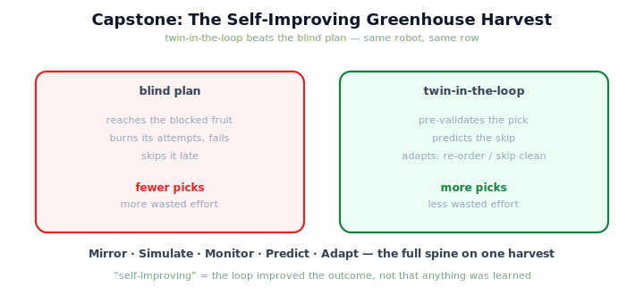

!!! abstract "You are here"
    **Module 10 — Digital Twin Capstone**  ·  **Unit 8 — Digital Twin Capstone & Curriculum Close**  ·  **Lesson 8.2 — Capstone — The Self-Improving Greenhouse Harvest**

# Lesson 8.2 — Capstone — The Self-Improving Greenhouse Harvest

> This is the moment the module was built for: every capability running together on one harvest, the twin advising each pick, and a real outcome that beats the blind plan. The whole spine, alive.

---

## 1. Why This Matters
Everything in Module 10 — mirror, simulate, monitor, predict, adapt — was built to make a deployed robot behave better. The capstone proves it on a full harvest: with the twin in the loop, the harvester foresees a blocked pick and adapts around it, ending the row with more fruit and less wasted effort than the same robot running blind. This is the payoff of the whole module in one runnable demonstration, and it does it without crossing the scope line: no learning, no optimization — just the existing system, rehearsed and steered by its twin.

## 2. Physical Intuition
A surgeon rehearsing each step on a patient-specific model mid-procedure. Before a risky move, they run it on the model (pre-validate), see it would go wrong, and choose a safer alternative (adapt) — improving the real operation's outcome without the model ever 'learning' anything. The capstone harvest is that, repeated down a row: rehearse each pick in the twin, foresee the failures, steer around them, and finish with a better real result than going in blind.

## 3. Mathematical Foundations
The capstone is the **assembled system (8.1) run to completion**, compared against a **blind baseline**. Let the row be harvested two ways. *Blind*: the real robot executes the naive plan with no twin advice, yielding outcome $o_{\text{blind}}$. *Twin-in-the-loop*: each fruit runs the cycle

$$\text{monitor} \to \text{re-sync if drifted} \to \text{predict} \to \text{adapt (pre-validate + choose)} \to \text{act},$$

yielding $o_{\text{loop}}$. The capstone's claim is that, when reality contains an effect the blind plan ignores (an obstacle on a fruit),

$$\text{score}(o_{\text{loop}}) \ge \text{score}(o_{\text{blind}})$$

because the twin **pre-validates the blocked pick, predicts the skip, and adapts** (skip-and-continue or re-order) instead of wasting attempts. 'Self-improving' is precisely this: the **loop improved the real outcome**. What did *not* happen: no parameters were updated, no policy was learned, no objective was optimized over a space. The improvement comes entirely from **running the existing system in the twin to decide** — the full spine, on one harvest.

## 4. Visual Explanation

<figure markdown>
  { width="680" }
</figure>

## 5. Engineering Example
On a row where one fruit sits behind an obstacle, the blind harvester reaches for it, burns its attempts, fails, and only then moves on — losing time and sometimes knocking a neighbor. The twin-in-the-loop harvester instead pre-validates that pick, sees the twin forecast a skip, and adapts: it re-orders to take the reachable fruit first and skips the blocked one cleanly. Same robot, same row — but the twin-advised run ends with more fruit picked and less wasted motion. That is a self-improving greenhouse harvest.

## 6. Worked Example
Compare the two runs concretely. *Blind*: attempts the blocked fruit, exhausts its retries, records it skipped after wasted effort — net: fewer clean picks, more attempts spent. *Twin-in-the-loop*: at that fruit, pre-validation forecasts a skip (reject the blind reach); action-selection ranks 'skip-and-continue' above 'attempt' and chooses it; the robot moves on without waste, harvesting the rest cleanly — net: more clean picks, fewer wasted attempts, a better score. The twin never touched a motor; it only advised. The improvement is real and it is loop-driven — and nowhere did the system learn or optimize. That is the capstone's whole argument, demonstrated on one harvest.

## 7. Interactive Demonstration

<iframe src="../../demos/module10/lesson30_twin_in_the_loop_harvest.html" title="Capstone — The Self-Improving Greenhouse Harvest interactive demo" style="width:100%;height:520px;border:1px solid #e2e8f0;border-radius:12px"></iframe>

[Open this demo in a new tab ↗](../demos/module10/lesson30_twin_in_the_loop_harvest.html)

The flagship **Twin-in-the-Loop Harvest** runs here: reality and the twin harvest the row together; at each fruit the twin pre-validates the pick, and when it predicts a failure the orchestrator adapts (skip/re-order). A live ledger compares the twin-in-the-loop outcome against the blind plan, and the spine Mirror → Simulate → Monitor → Predict → Adapt lights up stage by stage. Reproducible and self-contained.

## 8. Coding Exercise

!!! tip "Run the hands-on notebook"
    `modules/module10/notebooks/lesson30_capstone_self_improving_harvest.ipynb` — open in JupyterLab and run **Kernel → Restart & Run All**.

*(The notebook is the capstone in code.)*
Harvest a row two ways on the same layout: once blind (naive plan, no twin advice) and once with the twin-in-the-loop cycle adapting around a blocked fruit. Assert the twin-in-the-loop run scores at least as well as the blind run (more or equal harvested, fewer or equal wasted attempts), and that reality stayed a separate object advised by the twin. This is the full spine, verified on one harvest.

## 9. Knowledge Check

Formative — unlimited attempts, immediate feedback; does not affect your grade.

<iframe src="../../quizzes/module10/lesson30_quiz.html" title="Capstone — The Self-Improving Greenhouse Harvest knowledge check" style="width:100%;height:720px;border:1px solid #e2e8f0;border-radius:12px"></iframe>

[Open this quiz in a new tab ↗](../quizzes/module10/lesson30_quiz.html)

*(Formative — unlimited attempts, immediate feedback.)*
Confirm the capstone runs the full spine on one harvest, that twin-in-the-loop adaptation produces an outcome at least as good as the blind plan when reality contains an unmodeled effect, and that 'self-improving' means loop-improved, not learned.

## 10. Challenge Problem
The capstone's improvement depends on the twin being faithful enough to foresee the block. Describe what happens to the comparison if the twin is *badly* miscalibrated (it doesn't know about the obstacle), and connect this back to Unit 4. Then state the one-sentence condition under which 'twin-in-the-loop' is guaranteed not to do worse than blind.

## 11. Common Mistakes
- **Reading 'self-improving' as 'learning'.** The loop improves the *outcome*; nothing is trained.
- **Crediting optimization.** The choice is a ranked pre-validation over a given candidate set.
- **Forgetting the twin's faithfulness matters.** A blind-spot in the twin blinds the loop.
- **Letting the twin act.** Reality acts; the twin advises — even in the capstone.

## 12. Key Takeaways
- The **capstone** runs the **full spine** Mirror → Simulate → Monitor → Predict → Adapt on **one harvest**.
- The twin **pre-validates, predicts failures, and adapts** so the real harvest beats the **blind plan**.
- **'Self-improving' = loop-improved outcome**, *not* learned — no parameters, no optimization.
- The improvement requires a **faithful enough twin** (Unit 4's calibration matters here).
- It is the **payoff of the whole module**, demonstrated and verified on a real run.

---

## AI Learning Companion
Copy any prompt into an AI assistant.

**Tutor prompt** — explain it another way
```
Re-explain Lesson 8.2 with a surgeon rehearsing each risky step on a patient-specific model mid-procedure, foreseeing a bad outcome and choosing a safer step — improving the real operation without the model learning anything.
```
**Practice prompt** — generate more exercises
```
Give me 4 row scenarios; for each, predict whether twin-in-the-loop beats the blind plan and by what mechanism (pre-validate/predict/adapt). With answers.
```
**Explore prompt** — connect it to the real world
```
Show me real cases where a digital twin running in the loop measurably improved a physical operation's outcome, and how the improvement was attributed (loop vs learning).
```

## Global Learning Support
Need this lesson in another language? Copy a prompt below into an AI assistant. English is the authoritative source.

**Supported languages (initial):** English · Español · 中文 (Simplified Chinese) · Türkçe

```
I just completed Lesson 8.2 — Capstone — The Self-Improving Greenhouse Harvest.
Explain this lesson in Español. Keep robotics/math terminology in English where appropriate.
Then provide: a summary, three practice questions, and one challenge problem.
```
```
I just completed Lesson 8.2 — Capstone — The Self-Improving Greenhouse Harvest.
Explain this lesson in 中文 (Simplified Chinese). Keep robotics/math terminology in English where appropriate.
Then provide: a summary, three practice questions, and one challenge problem.
```
```
I just completed Lesson 8.2 — Capstone — The Self-Improving Greenhouse Harvest.
Explain this lesson in Türkçe. Keep robotics/math terminology in English where appropriate.
Then provide: a summary, three practice questions, and one challenge problem.
```

---

*Next lesson: 8.3 — The Whole Journey: One Tomato Through Ten Modules.*
