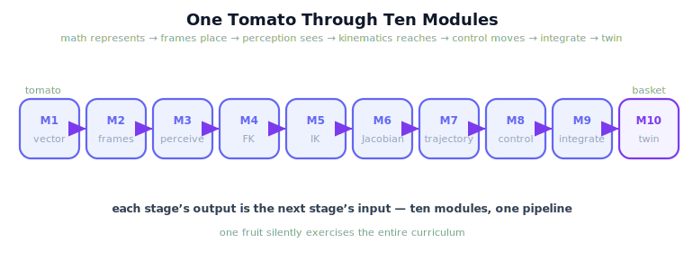

!!! abstract "You are here"
    **Module 10 — Digital Twin Capstone**  ·  **Unit 8 — Digital Twin Capstone & Curriculum Close**  ·  **Lesson 8.3 — The Whole Journey — One Tomato Through Ten Modules**

# Lesson 8.3 — The Whole Journey — One Tomato Through Ten Modules

> Every module was a chapter; this lesson is the through-line. Follow one tomato from a vector on a page to a fruit in the basket, and watch ten modules become one system.

---

## 1. Why This Matters
Modules are taught one at a time, but a robot uses them all at once. This lesson is the synthesis the whole curriculum was building toward: a single concrete object — one tomato — followed from the mathematics that represents it to the twin that watches it being picked. Seeing the journey end to end is what turns ten separate skills into one understanding. It answers the question a student should be able to answer at the finish: *how do all of these fit together into a system that actually harvests fruit?* This is a first-class learning objective, not an epilogue — the trace is the point.

## 2. Physical Intuition
Following one drop of water from cloud to tap. Each stage of the water system (condensation, rivers, reservoir, treatment, pipes) is its own subject, but the drop passes through all of them in order to reach your glass. Follow the tomato the same way: it passes through ten modules in order, each doing its one job, and arrives in the basket. The journey makes the system legible — you stop seeing ten topics and start seeing one pipeline.

## 3. Mathematical Foundations
**One tomato, ten stages.** Let the tomato hang at a point in space; follow it through the pipeline.

1. **M1 — Mathematical Foundations.** Represent the tomato's position as a vector $\mathbf{p}\in\mathbb{R}^3$; linear algebra is the language for everything that follows.
2. **M2 — Coordinate Frames & Rigid Motion.** Express $\mathbf{p}$ in the right frame and move it between camera, robot, and world frames via rigid transforms $T\in SE(3)$.
3. **M3 — Perception.** The camera *sees* the tomato; perception turns pixels into an estimated 3D position $\hat{\mathbf{p}}$ in the world frame.
4. **M4 — Forward Kinematics.** Given joint angles $\boldsymbol{\theta}$, FK says where the arm's tip *is*: $\mathbf{x}=\text{fk}(\boldsymbol{\theta})$.
5. **M5 — Inverse Kinematics.** Invert it: find the joint angles that put the tip *on the tomato*, $\boldsymbol{\theta}^\star=\text{ik}(\hat{\mathbf{p}})$.
6. **M6 — Jacobians & Differential Motion.** The Jacobian $J(\boldsymbol{\theta})$ relates joint rates to tip motion ($\dot{\mathbf{x}}=J\dot{\boldsymbol{\theta}}$), shaping a smooth, well-conditioned approach.
7. **M7 — Trajectory / Reference.** Plan a time-parameterized reference from the current pose to the tomato — the path the tip should follow.
8. **M8 — Feedback Control & Real-Time Execution.** Track that reference in real time, correcting error as the arm moves to the fruit.
9. **M9 — Integration.** Run perception → IK → trajectory → control as one harvest pipeline that actually picks the tomato.
10. **M10 — Digital Twin.** Mirror the running system, *monitor* the pick, *predict* whether it will succeed, and *adapt* if the twin foresees a problem.

Read top to bottom, the list is **one sentence**: *math represents the tomato, frames place it, perception sees it, kinematics reaches it, the Jacobian and trajectory shape the motion, control executes it, integration runs it, and the twin watches and steers it.* That sentence is the whole curriculum.

## 4. Visual Explanation

<figure markdown>
  { width="680" }
</figure>

## 5. Engineering Example
In the deployed greenhouse harvester, picking one tomato silently exercises all ten modules: the camera and perception stack localize it (M2-M3) using the vector/linear-algebra machinery (M1); IK and the Jacobian compute and shape the reach (M5-M6) on top of the arm's forward model (M4); a planned reference (M7) is tracked by the real-time controller (M8); the integrated pipeline (M9) executes the pick; and the twin (M10) monitors, predicts, and adapts so the pick succeeds even when reality surprises the plan. One fruit, the entire curriculum.

## 6. Worked Example
Follow the tomato once, narrated. It hangs at a point — **M1** writes that point as a vector. **M2** moves it from the camera's view into the robot's world frame. **M3** detects it and estimates its 3D position. **M4** tells the system where the arm tip currently is; **M5** solves the joint angles to put the tip on the fruit; **M6** keeps the approach smooth and away from singularities. **M7** lays down the path to follow; **M8** drives the arm along it in real time, correcting as it goes. **M9** runs all of that as one harvest. And **M10** mirrors the run, foresees the obstacle that would have caused a miss, and adapts so the tomato lands in the basket. Ten modules, one fruit, one continuous story.

## 7. Interactive Demonstration
*(Conceptual — replays the capstone with the M1-M10 trace overlaid.)*
Watch the capstone harvest a single tomato while each module lights up as its contribution is used — vector, frame, detection, FK, IK, Jacobian, trajectory, control, integration, twin — so the ten chapters resolve into one pipeline.

## 8. Coding Exercise

!!! tip "Run the hands-on notebook"
    `modules/module10/notebooks/lesson31_one_tomato_ten_modules.ipynb` — open in JupyterLab and run **Kernel → Restart & Run All**.

*(The notebook traces one tomato through the stack.)*
Using the existing functions, take one fruit and step through the pipeline: represent/transform its position, detect it, solve IK to reach it, run the harvest pick, and mirror+monitor it in the twin. Assert each stage produces the expected hand-off to the next (a position, a pose, joint angles, a successful pick, a synced twin). This makes the ten-module journey concrete and executable.

## 9. Knowledge Check

Formative — unlimited attempts, immediate feedback; does not affect your grade.

<iframe src="../../quizzes/module10/lesson31_quiz.html" title="The Whole Journey — One Tomato Through Ten Modules knowledge check" style="width:100%;height:720px;border:1px solid #e2e8f0;border-radius:12px"></iframe>

[Open this quiz in a new tab ↗](../quizzes/module10/lesson31_quiz.html)

*(Formative — unlimited attempts, immediate feedback.)*
Confirm the end-to-end trace: name each module's single contribution to harvesting one tomato (M1 vectors → M10 twin) and state how the stages connect into one Physical AI system.

## 10. Challenge Problem
Pick any one module and describe, in two or three sentences, exactly what would break in the journey if that module were missing — what hand-off would fail and why the tomato would not be harvested. Do this for the module you found hardest, to prove you can place it in the whole.

## 11. Common Mistakes
- **Seeing ten topics instead of one pipeline.** The modules are stages of a single hand-off chain.
- **Forgetting M1's role.** The vector/linear-algebra language underlies every later stage.
- **Treating the twin as separate.** M10 wraps and watches the M1-M9 pipeline; it is part of the journey.
- **Skipping a hand-off.** Each stage's output is the next stage's input — perception's position feeds IK, IK's angles feed control, and so on.

## 12. Key Takeaways
- One tomato passes through **all ten modules in order**, each doing **one job**.
- The journey is **one sentence**: math represents, frames place, perception sees, kinematics reaches, trajectory and control move, integration runs, the twin watches and steers.
- Every stage's **output is the next stage's input** — the modules are **hand-offs in one pipeline**.
- Seeing the trace end to end is what turns **ten skills into one understanding**.
- This synthesis is a **first-class objective**: a finished student can place every module in the whole.

---

## AI Learning Companion
Copy any prompt into an AI assistant.

**Tutor prompt** — explain it another way
```
Re-explain Lesson 8.3 by following one drop of water from cloud to tap through each stage of the water system — then map each stage to a module (M1-M10) harvesting one tomato.
```
**Practice prompt** — generate more exercises
```
Quiz me: for each of the ten modules, state its single contribution to harvesting one tomato, and the hand-off it passes to the next module. With answers.
```
**Explore prompt** — connect it to the real world
```
Show me how a real fruit-harvesting or pick-and-place robot pipeline maps perception, kinematics, planning, control, integration, and (if used) a digital twin onto its software stack.
```

## Global Learning Support
Need this lesson in another language? Copy a prompt below into an AI assistant. English is the authoritative source.

**Supported languages (initial):** English · Español · 中文 (Simplified Chinese) · Türkçe

```
I just completed Lesson 8.3 — The Whole Journey — One Tomato Through Ten Modules.
Explain this lesson in Español. Keep robotics/math terminology in English where appropriate.
Then provide: a summary, three practice questions, and one challenge problem.
```
```
I just completed Lesson 8.3 — The Whole Journey — One Tomato Through Ten Modules.
Explain this lesson in 中文 (Simplified Chinese). Keep robotics/math terminology in English where appropriate.
Then provide: a summary, three practice questions, and one challenge problem.
```
```
I just completed Lesson 8.3 — The Whole Journey — One Tomato Through Ten Modules.
Explain this lesson in Türkçe. Keep robotics/math terminology in English where appropriate.
Then provide: a summary, three practice questions, and one challenge problem.
```

---

*Next lesson: 8.4 — Course Close: From Mathematics to a Digital Twin.*
