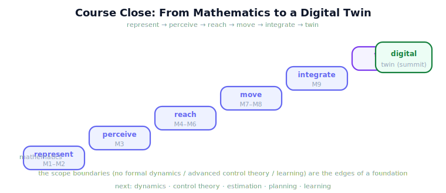

!!! abstract "You are here"
    **Module 10 — Digital Twin Capstone**  ·  **Unit 8 — Digital Twin Capstone & Curriculum Close**  ·  **Lesson 8.4 — Course Close — From Mathematics to a Digital Twin**

# Lesson 8.4 — Course Close — From Mathematics to a Digital Twin

> Ten modules ago this was vectors on a page. It is now a harvester that sees, reaches, moves, executes, integrates, and twins. This is the close — what you built, and where it points.

---

## 1. Why This Matters
A course should end by making its shape visible. Across ten modules you built, piece by piece, a Physical AI system: the mathematics to represent the world, the kinematics to act in it, the control to act reliably, the integration to act as one system, and the digital twin to watch, forecast, and steer that system. Closing the course means stepping back to see that the pieces were never separate — they were always one pipeline being assembled. It also means being honest about the boundaries deliberately drawn (no formal dynamics, no learning, no advanced control theory) so you know exactly where your foundation ends and where the next courses begin.

## 2. Physical Intuition
Standing at the top of a staircase you built one step at a time. Each module was a step; from the bottom they looked like separate tasks, but from the top they are obviously one staircase leading somewhere. The view from the top is this lesson: you can see the whole climb — math at the bottom, a twinned harvester at the top — and the next flight of stairs (dynamics, learning, advanced control) waiting beyond the landing.

## 3. Mathematical Foundations
There is **one through-line**, and it is worth stating plainly. Every module added one capability to a single growing pipeline:

$$\underbrace{\text{represent}}_{\text{M1-M2}} \to \underbrace{\text{perceive}}_{\text{M3}} \to \underbrace{\text{reach}}_{\text{M4-M6}} \to \underbrace{\text{move}}_{\text{M7-M8}} \to \underbrace{\text{integrate}}_{\text{M9}} \to \underbrace{\text{twin}}_{\text{M10}}.$$

That is Physical AI as this curriculum teaches it: **from mathematics to a digital twin**, each stage resting on the one before. The course also drew clear **boundaries** on purpose: it stayed with kinematics and geometric reasoning (no formal dynamics — no forces, masses, or torques as a theory), with intuitive feedback control (no Laplace/transfer-function machinery), and with twin-based decision-making (no machine learning, RL, or optimization). Those boundaries are not gaps to apologize for; they are the **edges of a solid foundation**. Beyond them lie the natural next courses — dynamics and force control, formal control theory, estimation and SLAM, motion planning at scale, and learning-based methods — each of which now has somewhere to attach. You finish able to represent, perceive, reach, move, integrate, and twin a robot. That is a Physical AI system, and it is yours.

## 4. Visual Explanation

<figure markdown>
  { width="680" }
</figure>

## 5. Engineering Example
What you can now build: a robot that represents its world mathematically, perceives a target, computes and shapes a reach, plans and executes the motion under feedback, runs the whole thing as an integrated system, and mirrors it in a digital twin that monitors, predicts, and adapts. That is a deployable Physical AI capability — the greenhouse harvester is one instance, but the same pipeline picks parts off a line, places components on a board, or guides a tool to a workpiece. The application changes; the through-line does not.

## 6. Worked Example
Read the arc once more, as a single climb. **M1-M2** gave you the language to represent the world. **M3** let the robot see. **M4-M6** let it reach — knowing where its arm is, solving where to put it, and shaping the motion. **M7-M8** let it move — planning a path and executing it reliably under feedback. **M9** made the pieces one system. **M10** wrapped that system in a twin that watches, forecasts, and steers it. Math at the bottom, a self-improving harvest at the top. Every step rested on the last, and none was wasted. That is the course — and the foundation you now stand on.

## 7. Interactive Demonstration
*(Conceptual — a closing replay.)*
Replay the journey one last time: the staircase from a vector to a twinned harvester, each module lighting as its stage is climbed, ending on the summit with the signpost to what comes next.

## 8. Coding Exercise

!!! tip "Run the hands-on notebook"
    `modules/module10/notebooks/lesson32_course_close.ipynb` — open in JupyterLab and run **Kernel → Restart & Run All**.

*(The notebook closes the course.)*
Run a final end-to-end check: harvest a row with the twin in the loop and confirm the full system completes — the capstone, run once more as the course's closing verification. Assert the run finishes and the spine's stages all executed. A clean 'All checks passed.' is the curriculum's last green light.

## 9. Knowledge Check

Formative — unlimited attempts, immediate feedback; does not affect your grade.

<iframe src="../../quizzes/module10/lesson32_quiz.html" title="Course Close — From Mathematics to a Digital Twin knowledge check" style="width:100%;height:720px;border:1px solid #e2e8f0;border-radius:12px"></iframe>

[Open this quiz in a new tab ↗](../quizzes/module10/lesson32_quiz.html)

*(Formative — unlimited attempts, immediate feedback.)*
Confirm the close: the through-line from mathematics to a digital twin (represent → perceive → reach → move → integrate → twin), the deliberate scope boundaries, and at least two directions for further study.

## 10. Challenge Problem
Write your own two-sentence statement of what Physical AI is, based on this curriculum's through-line, and name the one next topic you most want to learn and exactly where it would attach to the pipeline you built. There is no single right answer — the point is to place yourself at the top of the staircase and look forward.

## 11. Common Mistakes
- **Treating the scope boundaries as failures.** They are the clean edges of a solid foundation, not omissions.
- **Forgetting the through-line.** The ten modules are one pipeline, not ten unrelated topics.
- **Stopping at techniques.** The aim was a *system*; the techniques served it.
- **Thinking the twin replaces the robot.** The twin advises; the real system always does the work.

## 12. Key Takeaways
- The curriculum is **one arc**: from **mathematics to a digital twin**.
- The **through-line** is **represent → perceive → reach → move → integrate → twin** (M1 → M10).
- The **scope boundaries** (no formal dynamics, no advanced control theory, no learning) are the **edges of a foundation**, by design.
- You can now **build a Physical AI system** — perceive, reach, move, integrate, and twin a robot.
- The next courses — **dynamics, control theory, estimation, planning, learning** — now have **somewhere to attach**.

---

## AI Learning Companion
Copy any prompt into an AI assistant.

**Tutor prompt** — explain it another way
```
Re-explain Lesson 8.4 as standing at the top of a staircase you built one step at a time — each module a step, the whole climb from mathematics to a twinned harvester now visible, with the next flight waiting beyond.
```
**Practice prompt** — generate more exercises
```
Ask me to summarize the entire curriculum in my own words: the through-line, each module's role, the scope boundaries, and where I'd go next. Then critique my summary.
```
**Explore prompt** — connect it to the real world
```
Show me how the topics this curriculum deliberately left out — dynamics, formal control theory, estimation/SLAM, motion planning, learning-based control — build on a kinematics-and-twin foundation like this one.
```

## Global Learning Support
Need this lesson in another language? Copy a prompt below into an AI assistant. English is the authoritative source.

**Supported languages (initial):** English · Español · 中文 (Simplified Chinese) · Türkçe

```
I just completed Lesson 8.4 — Course Close — From Mathematics to a Digital Twin.
Explain this lesson in Español. Keep robotics/math terminology in English where appropriate.
Then provide: a summary, three practice questions, and one challenge problem.
```
```
I just completed Lesson 8.4 — Course Close — From Mathematics to a Digital Twin.
Explain this lesson in 中文 (Simplified Chinese). Keep robotics/math terminology in English where appropriate.
Then provide: a summary, three practice questions, and one challenge problem.
```
```
I just completed Lesson 8.4 — Course Close — From Mathematics to a Digital Twin.
Explain this lesson in Türkçe. Keep robotics/math terminology in English where appropriate.
Then provide: a summary, three practice questions, and one challenge problem.
```

---

*End of Module 10 — and the close of the Physical AI curriculum. Congratulations.*
